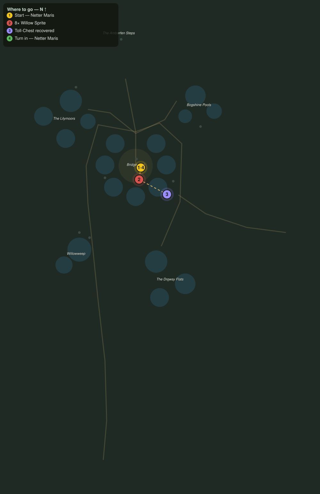

# Toll and Tangle

> Quest ID: `q_wf_toll_and_tangle` · The Willowfen

| | |
|---|---|
| **Recommended level** | 19+ |
| **Quest giver** | **Netter Maris**, Eel-Netter of Bridgemere _(at ~x:-354, z:364)_ |
| **Turn in to** | **Netter Maris**, Eel-Netter of Bridgemere _(at ~x:-354, z:364)_ |
| **Requires** | Eels for the Smokehouse (`q_wf_eels_for_the_smokehouse`) |

## Story

> The willow sprites think it is a fine game to cut a ferry loose, <your name>, and last week the toll skiff went over on the east track with a season of bridge-toll aboard. The chests went down in the shallows and the sprites dance on the boardwalks like they own them. Drive off eight and haul up three toll-chests, and Bridgemere eats this winter.

## How to complete

- **Kill 8× [Willow Sprite](bestiary.md#mob-willow_sprite)** (level 19–20)
  - Found in the open world at ~x:-396, z:376 (3 mobs, radius 10)
  - Found in the open world at ~x:-316, z:380 (2 mobs, radius 10)
  - _Tracker: Willow Sprite driven off_
- **Interact 3× with Sunken Toll-Chest**
  - Locations: ~x:-324, z:360 · ~x:-320, z:398 · ~x:-326, z:428
  - _Tracker: Toll-Chest recovered_

Then return to **Netter Maris**, Eel-Netter of Bridgemere _(at ~x:-354, z:364)_ to turn in.

## Rewards

- **XP:** 5400
- **Money:** 2800 copper

## On completion

> Three chests, and the coin still dry inside. The sprites will sulk in the withies for a week, $N, and the town owes you its winter bread.

## Where to go

**[🧭 Open this route in 3D →](#/questroute/q_wf_toll_and_tangle)**

_Numbered route: ① start → objectives → 4 turn in. Faint dots are the rest of the zone for context — see the [full zone map](README.md). Mob names above link to the [bestiary](bestiary.md)._
