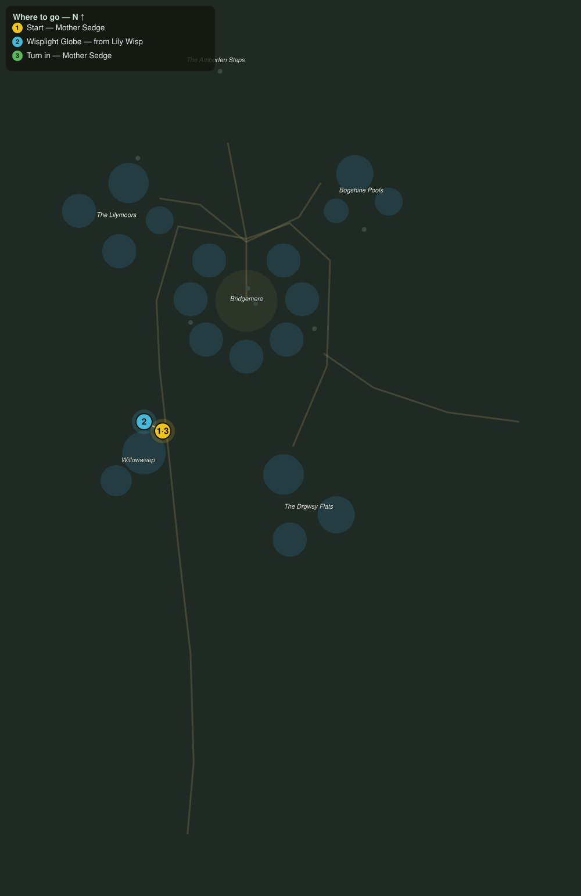

# Wisplight Charms

> Quest ID: `q_wf_wisplight_charms` · The Willowfen

| | |
|---|---|
| **Recommended level** | 19+ (zone range 19–20) |
| **Quest giver** | **Mother Sedge**, Fen-Witch of Willowweep _(at ~x:-414, z:446)_ |
| **Turn in to** | **Mother Sedge**, Fen-Witch of Willowweep _(at ~x:-414, z:446)_ |
| **Requires** | The Witch of Willowweep (`q_wf_witch_of_willowweep`) |

## Story

> The wisps over the pools are the fen dreaming out loud, <your name>, and their light is the only thing that holds against the Croaker's lull. I weave it into willow charms: one round your neck and the snore cannot drag your eyelids down. Bring me six wisplight globes. The wisps will not fight you for them, which makes it a kindness or a theft, depending on how you carry it.

## How to complete

- **Collect 6× Wisplight Globe**
  - Drops from [**Lily Wisp**](bestiary.md#mob-lily_wisp) (65% chance) — Found in the open world at ~x:-426, z:440 (4 mobs, radius 12)
  - _Tracker: Wisplight Globe_

Then return to **Mother Sedge**, Fen-Witch of Willowweep _(at ~x:-414, z:446)_ to turn in.

## Rewards

- **XP:** 4800
- **Money:** 2400 copper

## On completion

> Six globes, still warm with dreaming. Give me till moonrise and I will have charms woven for you and whoever is brave enough to stand beside you.

## Leads to

- The Croaker's Hush (`q_wf_croakers_hush`)

## Where to go

**[🧭 Open this route in 3D →](#/questroute/q_wf_wisplight_charms)**

_Numbered route: ① start → objectives → 3 turn in. Faint dots are the rest of the zone for context — see the [full zone map](README.md). Mob names above link to the [bestiary](bestiary.md)._
