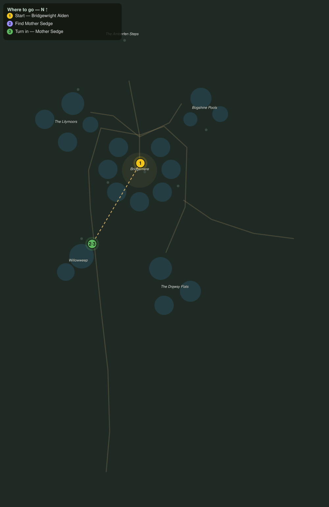

# The Witch of Willowweep

> Quest ID: `q_wf_witch_of_willowweep` · The Willowfen

| | |
|---|---|
| **Recommended level** | 19+ |
| **Quest giver** | **Bridgewright Alden**, Master of the Fenway _(at ~x:-359, z:354)_ |
| **Turn in to** | **Mother Sedge**, Fen-Witch of Willowweep _(at ~x:-414, z:446)_ |
| **Requires** | The Rope-Chewers (`q_wf_rope_chewers`) |

## Story

> You have heard it by now, <your name>: the snore. Slow and heavy, out past the Drowsy Flats, like the fen itself turning over in its sleep. The toads, the sprites, the wisps burning at noon: it all started when that sound did. One soul might know what it is. Mother Sedge keeps a camp at Willowweep, west around the moat and down the far shore. Find her, and ask her what sleeps at the middle of my fen.

## How to complete

- **Interact with **Mother Sedge**, Fen-Witch of Willowweep _(at ~x:-414, z:446)_**
  - _Tracker: Find Mother Sedge_

Then return to **Mother Sedge**, Fen-Witch of Willowweep _(at ~x:-414, z:446)_ to turn in.

## Rewards

- **XP:** 2800
- **Money:** 1000 copper

## On completion

> Alden sent you all this way to ask about the snoring? Then the bridge-folk are finally listening. Sit down out of the damp, $N. That sound has a name, and a throat, and I have been waiting for someone fool enough to help me quiet it.

## Leads to

- Wisplight Charms (`q_wf_wisplight_charms`)

## Where to go

**[🧭 Open this route in 3D →](#/questroute/q_wf_witch_of_willowweep)**

_Numbered route: ① start → objectives → 3 turn in. Faint dots are the rest of the zone for context — see the [full zone map](README.md). Mob names above link to the [bestiary](bestiary.md)._
