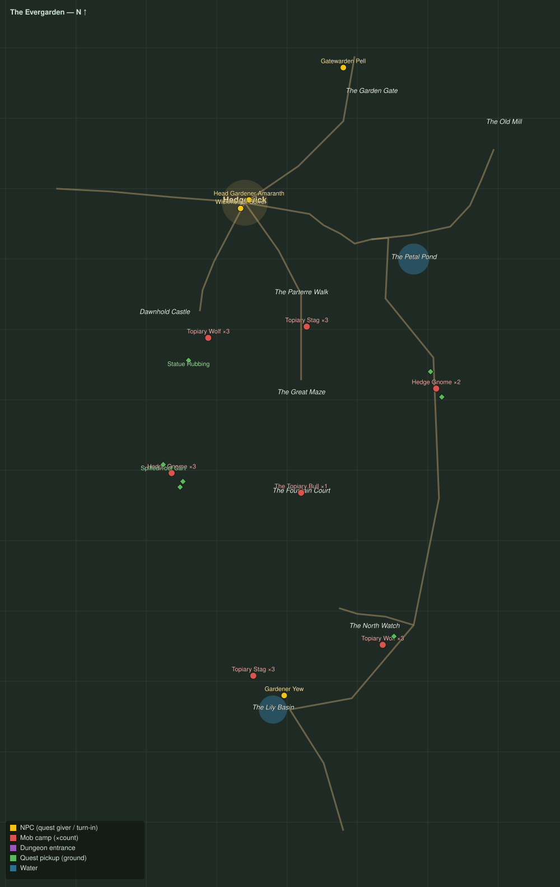

# The Evergarden

Level range: **20–20** · Hub: Hedgewick · 8 quests

_Gold = NPCs · red = mob camps (×count) · purple = dungeon entrances · green = ground pickups · blue = water._

📖 **[Bestiary for this zone](bestiary.md)** — every mob's health, armor, damage, and how to kill it.

| Lvl | Quest | Giver | Type |
|----:|-------|-------|------|
| 19 | [Word Through the Gate](q-eg-gate-report.md) | Gatewarden Pell | interact |
| 20 | [Pruned into Hunger](q-eg-hungry-shapes.md) | Head Gardener Amaranth | kill |
| 20 | [The Stolen Shears](q-eg-stolen-shears.md) | Wickmother Sorrel | collect |
| 20 | [The Groundskeepers Grudge](q-eg-gnomes-in-the-green.md) | Wickmother Sorrel | kill/interact |
| 20 | [Who Trims the Hedges](q-eg-who-trims-the-hedges.md) | Head Gardener Amaranth | interact |
| 20 | [Clippings from the Living Green](q-eg-bloom-clippings.md) | Gardener Yew | collect |
| 20 | [The Four Quiet Sisters](q-eg-four-statues.md) | Gardener Yew | interact |
| 20 | [The Bull of the Fountain Court](q-eg-bull-of-the-court.md) 👥 | Gardener Yew | kill |
