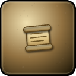
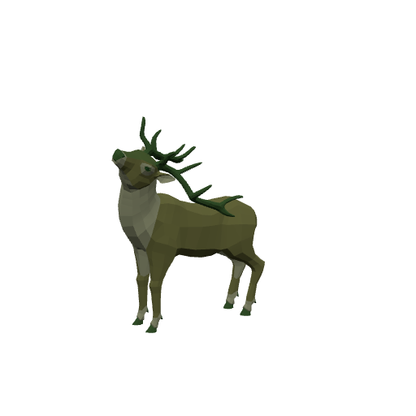
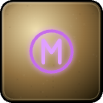
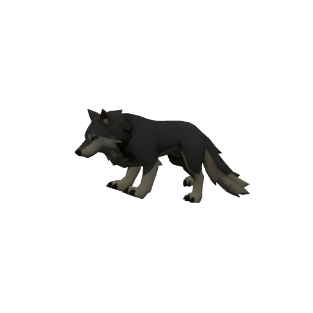
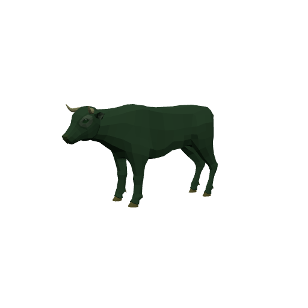

# Bestiary — The Evergarden

4 creatures you'll fight in this zone. Health/armor/damage are shown across the mob's spawn level range (mobs roll a random level within it). Mitigation % is what a same-level attacker's physical hits lose to armor — spells ignore armor.

> Threat tiers: **Boss** (dungeon, group it) · **Elite** (~2.3× HP, ~1.5× damage) · **Rare** (tough roamer) · normal (everything else).

## Common creatures

### Hedge Gnome

| Stat | Value |
|---|---|
| Level | 20 |
| Family | Kobold |
| Health | 394 HP |
| Armor (physical mitigation) | 190 (~8% vs a same-level attacker) |
| Melee damage | 42–66 per hit @ 1.8s swing (~30 DPS) |
| Location | The Evergarden · ~x:268, z:1002 · ~x:456, z:942 — [🗺️ show on map](#/map/268/1002) |

**Best way to kill:**

- Straightforward melee attacker — tank it, heal as needed, and burn it down. No special tricks.

**Loot:**

- Coins: 105 copper (always drops)

| Item | Type | Drop chance | Notes |
|---|---|---:|---|
|   Stolen Hedgewick Shears | Quest item | 60% | quest item — only drops while on _The Stolen Shears_ |

### Topiary Stag

| Stat | Value |
|---|---|
| Level | 20 |
| Family | Beast |
| Health | 398 HP |
| Armor (physical mitigation) | 228 (~10% vs a same-level attacker) |
| Melee damage | 41–65 per hit @ 2s swing (~27 DPS) |
| Location | The Evergarden · ~x:364, z:898 · ~x:326, z:1146 — [🗺️ show on map](#/map/364/898) |

**Best way to kill:**

- Straightforward melee attacker — tank it, heal as needed, and burn it down. No special tricks.

**Loot:**

- Coins: 105 copper (always drops)

| Item | Type | Drop chance | Notes |
|---|---|---:|---|
|   Pruned Bloom Clipping | Quest item | 65% | quest item — only drops while on _Clippings from the Living Green_ |

### Topiary Wolf

| Stat | Value |
|---|---|
| Level | 20 |
| Family | Beast |
| Health | 419 HP |
| Armor (physical mitigation) | 209 (~9% vs a same-level attacker) |
| Melee damage | 45–70 per hit @ 1.9s swing (~30 DPS) |
| Location | The Evergarden · ~x:294, z:906 · ~x:418, z:1124 — [🗺️ show on map](#/map/294/906) |

**Best way to kill:**

- Straightforward melee attacker — tank it, heal as needed, and burn it down. No special tricks.

**Loot:**

- Coins: 105 copper (always drops)

## Elites

### The Topiary Bull — _Elite_

| Stat | Value |
|---|---|
| Level | 20 |
| Family | Beast |
| Health | 1842 HP |
| Armor (physical mitigation) | 323 (~13% vs a same-level attacker) |
| Melee damage | 89–139 per hit @ 2.2s swing (~52 DPS) |
| Respawn | ~25s |
| Location | The Evergarden · ~x:360, z:1016 — [🗺️ show on map](#/map/360/1016) |

**Best way to kill:**

- **Elite** — ~2.3× the health and ~1.5× the damage of a normal mob; bring a group or out-level it.
- Straightforward melee attacker — tank it, heal as needed, and burn it down. No special tricks.

**Loot:**

- Coins: 450 copper (always drops)

| Item | Type | Drop chance | Notes |
|---|---|---:|---|
|  ⚫ Tangled Weed | Junk | 100% | sells for 1c |

---

[← Back to The Evergarden quests](README.md) · [Zone map](map.svg)
