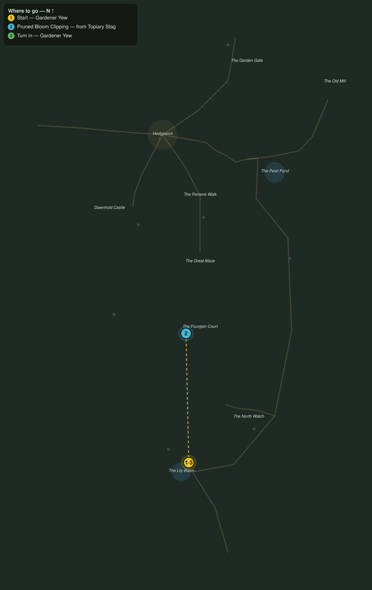

# Clippings from the Living Green

> Quest ID: `q_eg_bloom_clippings` · The Evergarden

| | |
|---|---|
| **Recommended level** | 20+ (zone range 20–20) |
| **Quest giver** | **Gardener Yew**, The Last Gardener _(at ~x:348, z:1160)_ |
| **Turn in to** | **Gardener Yew**, The Last Gardener _(at ~x:348, z:1160)_ |
| **Requires** | Who Trims the Hedges (`q_eg_who_trims_the_hedges`) |

## Story

> You want to understand this garden? Then read it the way I do. The stags that graze the lawns grow the truest green: every leaf on them is a page. Bring me six fresh clippings from the topiary stags, <your name>. They will not thank you for the pruning, but they will regrow. Everything here regrows.

## How to complete

- **Collect 6× Pruned Bloom Clipping**
  - Drops from [**Topiary Stag**](bestiary.md#mob-topiary_stag) (65% chance) — Found in the open world at ~x:364, z:898 (3 mobs, radius 10); Found in the open world at ~x:326, z:1146 (3 mobs, radius 10)
  - _Tracker: Pruned Bloom Clipping_

Then return to **Gardener Yew**, The Last Gardener _(at ~x:348, z:1160)_ to turn in.

## Rewards

- **XP:** 4600
- **Money:** 2200 copper

## On completion

> Look here: the leaves are curling in on themselves, every clipping the same. The garden is afraid, $N. In a hundred years I have never once known it afraid.

## Where to go

**[🧭 Open this route in 3D →](#/questroute/q_eg_bloom_clippings)**

_Numbered route: ① start → objectives → 3 turn in. Faint dots are the rest of the zone for context — see the [full zone map](README.md). Mob names above link to the [bestiary](bestiary.md)._
