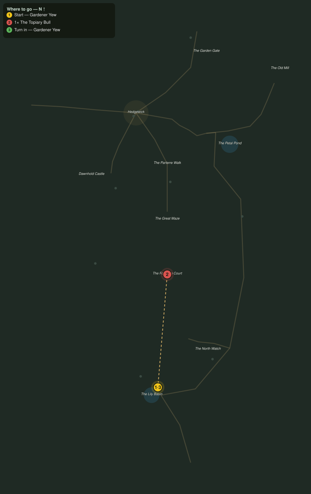

# The Bull of the Fountain Court

> Quest ID: `q_eg_bull_of_the_court` · The Evergarden

| | |
|---|---|
| **Recommended level** | 20+ |
| **Quest giver** | **Gardener Yew**, The Last Gardener _(at ~x:348, z:1160)_ |
| **Turn in to** | **Gardener Yew**, The Last Gardener _(at ~x:348, z:1160)_ |
| **Requires** | The Four Quiet Sisters (`q_eg_four_statues`) |
| **Group quest** | 👥 Suggested players: 2 |

## Story

> Now the truth, <your name>. The bull at the heart of the maze was my masterwork: I shaped him to guard the Fountain Court, and for a hundred years he did. But the fear in the green has reached him, and he guards nothing now, he hunts. The maze feeds him whoever wanders in. I am too old to unmake him, and it must be unmaking, root and branch. Bring a friend, walk the maze to the court, and cut my bull down.

## How to complete

- **Kill 1× [The Topiary Bull](bestiary.md#mob-the_topiary_bull)** (level 20–20, **Elite**)
  - Found in the open world at ~x:360, z:1016 (1 mob, radius 5)
  - _Tracker: The Topiary Bull unmade_

Then return to **Gardener Yew**, The Last Gardener _(at ~x:348, z:1160)_ to turn in.

## Rewards

- **XP:** 6200
- **Money:** 3800 copper
- **Item reward (by class):**
  -  🔵 Mantle of the Fountain Court — _warrior, mage, rogue_ · 74 armor, +4 Str, +6 Sta

## On completion

> I felt it, here, when he came apart. A hundred years of work, and you were right to end it. Take this mantle: I cut it for whoever proved stronger than my best. The court is only a fountain tonight, $N, and the garden is only a garden. Perhaps now the Head Gardener and I can both sleep.

## Where to go

**[🧭 Open this route in 3D →](#/questroute/q_eg_bull_of_the_court)**

_Numbered route: ① start → objectives → 3 turn in. Faint dots are the rest of the zone for context — see the [full zone map](README.md). Mob names above link to the [bestiary](bestiary.md)._
