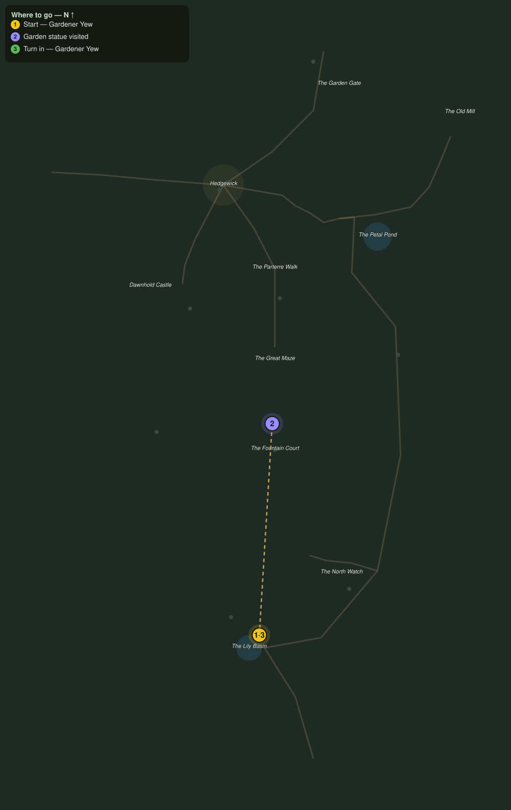

# The Four Quiet Sisters

> Quest ID: `q_eg_four_statues` · The Evergarden

| | |
|---|---|
| **Recommended level** | 20+ |
| **Quest giver** | **Gardener Yew**, The Last Gardener _(at ~x:348, z:1160)_ |
| **Turn in to** | **Gardener Yew**, The Last Gardener _(at ~x:348, z:1160)_ |
| **Requires** | Who Trims the Hedges (`q_eg_who_trims_the_hedges`) |

## Story

> When the garden was young, the first gardeners raised four marble sisters to watch its quarters: one above the Rose Wilds, one on the pond walk east of the maze, one on the west lawn where the gnomes keep their warren, and one on the south lawn past the hedges. The maze grew up between them, and most folk never see all four. Walk the quarters, <your name>, and press your palm to each sister. When the garden has looked you over from all four sides, it will open places it keeps from strangers.

## How to complete

- **Interact 4× with Statue Rubbing**
  - Locations: ~x:280, z:922 · ~x:452, z:930 · ~x:274, z:1012 · ~x:426, z:1118
  - _Tracker: Garden statue visited_

Then return to **Gardener Yew**, The Last Gardener _(at ~x:348, z:1160)_ to turn in.

## Rewards

- **XP:** 5200
- **Money:** 2600 copper

## On completion

> Four rubbings, four sisters, and not one of them wept marble. The garden has taken your measure, $N, and it did not find you wanting. Now I can send you where the trouble truly lives.

## Leads to

- The Bull of the Fountain Court (`q_eg_bull_of_the_court`)

## Where to go

**[🧭 Open this route in 3D →](#/questroute/q_eg_four_statues)**

_Numbered route: ① start → objectives → 3 turn in. Faint dots are the rest of the zone for context — see the [full zone map](README.md). Mob names above link to the [bestiary](bestiary.md)._
