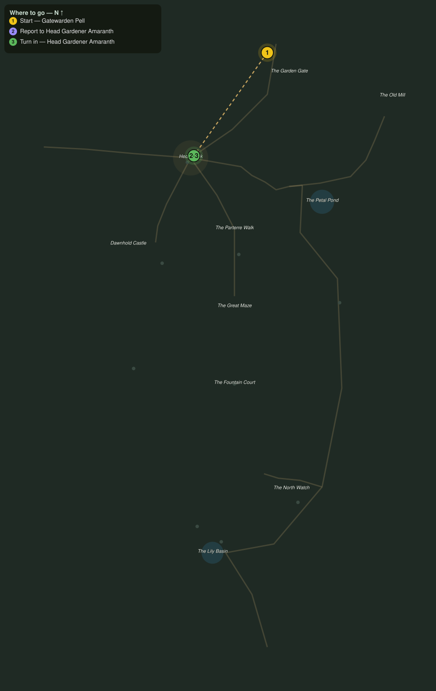

# Word Through the Gate

> Quest ID: `q_eg_gate_report` · The Evergarden

| | |
|---|---|
| **Recommended level** | 19+ |
| **Quest giver** | **Gatewarden Pell**, Keeper of the Garden Gate _(at ~x:390, z:714)_ |
| **Turn in to** | **Head Gardener Amaranth**, Head Gardener of the Evergarden _(at ~x:323, z:808)_ |

## Story

> The lawns past this gate have trimmed themselves for a hundred years, <your name>, and lately they have started trimming visitors. Head Gardener Amaranth keeps the books in Hedgewick, up the road past the gate lawns. Tell her another traveler has come through, and tell her the hedges by the gate moved last night.

## How to complete

- **Interact with **Head Gardener Amaranth**, Head Gardener of the Evergarden _(at ~x:323, z:808)_**
  - _Tracker: Report to Head Gardener Amaranth_

Then return to **Head Gardener Amaranth**, Head Gardener of the Evergarden _(at ~x:323, z:808)_ to turn in.

## Rewards

- **XP:** 2600
- **Money:** 950 copper

## On completion

> Moved, did they. Pell reports that every week, and every week he is right. Forgive my eyes, $N, I have not slept a whole night in years: someone has to watch the garden watch us. Welcome to Hedgewick.

## Leads to

- Pruned into Hunger (`q_eg_hungry_shapes`)
- The Stolen Shears (`q_eg_stolen_shears`)

## Where to go

**[🧭 Open this route in 3D →](#/questroute/q_eg_gate_report)**

_Numbered route: ① start → objectives → 3 turn in. Faint dots are the rest of the zone for context — see the [full zone map](README.md). Mob names above link to the [bestiary](bestiary.md)._
