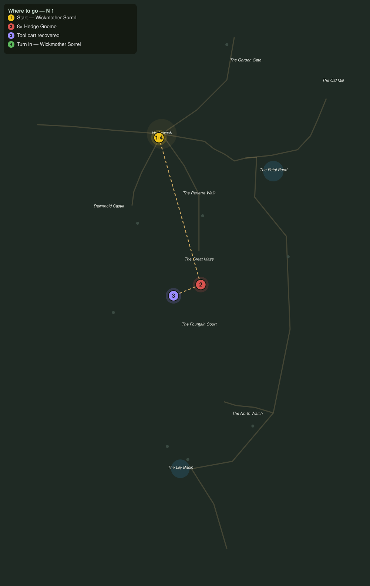

# The Groundskeepers Grudge

> Quest ID: `q_eg_gnomes_in_the_green` · The Evergarden

| | |
|---|---|
| **Recommended level** | 20+ |
| **Quest giver** | **Wickmother Sorrel**, Keeper of the Hedgewick Inn _(at ~x:317, z:814)_ |
| **Turn in to** | **Wickmother Sorrel**, Keeper of the Hedgewick Inn _(at ~x:317, z:814)_ |
| **Requires** | The Stolen Shears (`q_eg_stolen_shears`) |

## Story

> The shears were only the start, <your name>. Last night the gnomes tipped our tool carts into the green, one out by their warren west of the maze, one clean across the garden on the pond walk, and scattered a hundred years of good iron in the grass. Drive off eight of the little devils and haul the spilled carts home.

## How to complete

- **Kill 8× [Hedge Gnome](bestiary.md#mob-hedge_gnome)** (level 20–20)
  - Found in the open world at ~x:268, z:1002 (3 mobs, radius 10)
  - Found in the open world at ~x:456, z:942 (2 mobs, radius 10)
  - _Tracker: Hedge Gnome driven off_
- **Interact 3× with Spilled Tool Cart**
  - Locations: ~x:262, z:996 · ~x:276, z:1008 · ~x:460, z:948
  - _Tracker: Tool cart recovered_

Then return to **Wickmother Sorrel**, Keeper of the Hedgewick Inn _(at ~x:317, z:814)_ to turn in.

## Rewards

- **XP:** 5000
- **Money:** 2600 copper

## On completion

> Three carts back and the pegs full again. Let the little devils sulk in their hedges: Hedgewick works these lawns too.

## Where to go

**[🧭 Open this route in 3D →](#/questroute/q_eg_gnomes_in_the_green)**

_Numbered route: ① start → objectives → 4 turn in. Faint dots are the rest of the zone for context — see the [full zone map](README.md). Mob names above link to the [bestiary](bestiary.md)._
