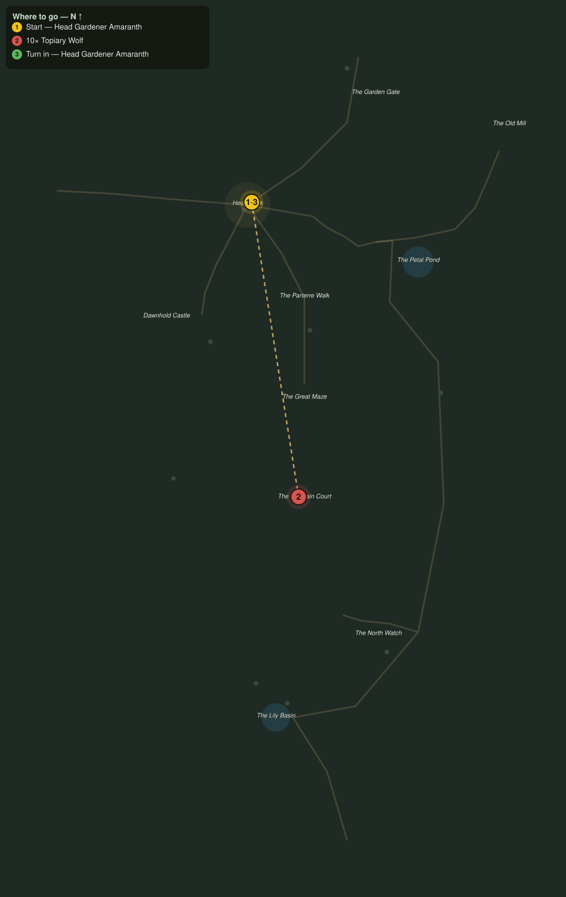

# Pruned into Hunger

> Quest ID: `q_eg_hungry_shapes` · The Evergarden

| | |
|---|---|
| **Recommended level** | 20+ (zone range 20–20) |
| **Quest giver** | **Head Gardener Amaranth**, Head Gardener of the Evergarden _(at ~x:323, z:808)_ |
| **Turn in to** | **Head Gardener Amaranth**, Head Gardener of the Evergarden _(at ~x:323, z:808)_ |
| **Requires** | Word Through the Gate (`q_eg_gate_report`) |

## Story

> Whoever shapes this garden has grown careless, or cruel. The wolf shapes out in the Rose Wilds were clipped for show, yet lately they hunt: green jaws, no bellies, and no reason ever to stop. Cut down ten topiary wolves, <your name>, and let the lawns be lawns again for a while.

## How to complete

- **Kill 10× [Topiary Wolf](bestiary.md#mob-topiary_wolf)** (level 20–20)
  - Found in the open world at ~x:294, z:906 (3 mobs, radius 10)
  - Found in the open world at ~x:418, z:1124 (3 mobs, radius 10)
  - Found in the open world at ~x:302, z:522 (3 mobs, radius 11)
  - Found in the open world at ~x:250, z:505 (3 mobs, radius 8)
  - _Tracker: Topiary Wolf slain_

Then return to **Head Gardener Amaranth**, Head Gardener of the Evergarden _(at ~x:323, z:808)_ to turn in.

## Rewards

- **XP:** 4600
- **Money:** 2200 copper

## On completion

> Ten heaps of clippings where ten wolves stood. It should feel like gardening, $N. Why does it feel like war?

## Leads to

- Who Trims the Hedges (`q_eg_who_trims_the_hedges`)

## Where to go

**[🧭 Open this route in 3D →](#/questroute/q_eg_hungry_shapes)**

_Numbered route: ① start → objectives → 3 turn in. Faint dots are the rest of the zone for context — see the [full zone map](README.md). Mob names above link to the [bestiary](bestiary.md)._
