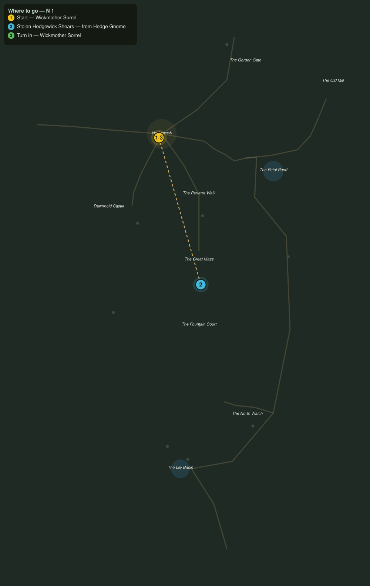

# The Stolen Shears

> Quest ID: `q_eg_stolen_shears` · The Evergarden

| | |
|---|---|
| **Recommended level** | 20+ (zone range 20–20) |
| **Quest giver** | **Wickmother Sorrel**, Keeper of the Hedgewick Inn _(at ~x:317, z:814)_ |
| **Turn in to** | **Wickmother Sorrel**, Keeper of the Hedgewick Inn _(at ~x:317, z:814)_ |
| **Requires** | Word Through the Gate (`q_eg_gate_report`) |

## Story

> Every pair of shears in Hedgewick has walked off in a fortnight, <your name>: off the pegs, out of locked sheds, one pair out of my own apron while I dozed. It is the hedge gnomes, the little groundskeepers who hate us walking their lawns. Get six pairs back before the whole hamlet is down to kitchen knives.

## How to complete

- **Collect 6× Stolen Hedgewick Shears**
  - Drops from [**Hedge Gnome**](bestiary.md#mob-hedge_gnome) (60% chance) — Found in the open world at ~x:268, z:1002 (3 mobs, radius 10); Found in the open world at ~x:456, z:942 (2 mobs, radius 10)
  - _Tracker: Stolen Hedgewick Shears_

Then return to **Wickmother Sorrel**, Keeper of the Hedgewick Inn _(at ~x:317, z:814)_ to turn in.

## Rewards

- **XP:** 4800
- **Money:** 2400 copper
- **Item reward (by class):**
  -  🟢 Shearkeeper Gloves — _warrior, mage, rogue_ · 52 armor, +3 Sta, +3 Spi

## On completion

> Six pairs, and my own among them, I would know the nick in the blade anywhere. Here, these gloves were knitted for pruning work. Warm hands make steady shears.

## Leads to

- The Groundskeepers Grudge (`q_eg_gnomes_in_the_green`)

## Where to go

**[🧭 Open this route in 3D →](#/questroute/q_eg_stolen_shears)**

_Numbered route: ① start → objectives → 3 turn in. Faint dots are the rest of the zone for context — see the [full zone map](README.md). Mob names above link to the [bestiary](bestiary.md)._
