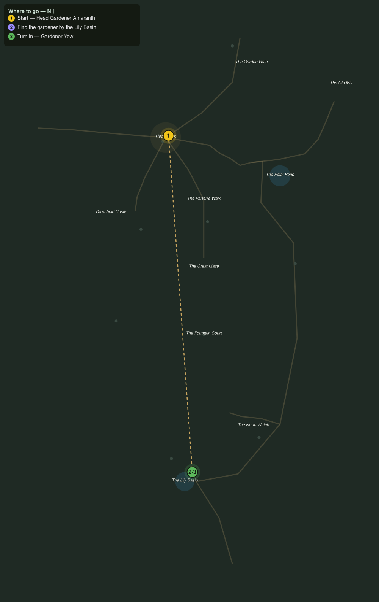

# Who Trims the Hedges

> Quest ID: `q_eg_who_trims_the_hedges` · The Evergarden

| | |
|---|---|
| **Recommended level** | 20+ |
| **Quest giver** | **Head Gardener Amaranth**, Head Gardener of the Evergarden _(at ~x:323, z:808)_ |
| **Turn in to** | **Gardener Yew**, The Last Gardener _(at ~x:348, z:1160)_ |
| **Requires** | Pruned into Hunger (`q_eg_hungry_shapes`) |

## Story

> I have kept the ledgers thirty years, <your name>, and not slept properly for ten of them, because the sums will not close. Grass wants cutting and hedges want shaping, and nobody here does either, yet every dawn the garden stands trimmed. Lately the woodfolk swear they see an old man with a barrow on the far south lawns, past the maze by the Lily Basin. Find him. If he is real, I can finally sleep. If he is not, I suppose I never will.

## How to complete

- **Interact with **Gardener Yew**, The Last Gardener _(at ~x:348, z:1160)_**
  - _Tracker: Find the gardener by the Lily Basin_

Then return to **Gardener Yew**, The Last Gardener _(at ~x:348, z:1160)_ to turn in.

## Rewards

- **XP:** 2800
- **Money:** 1000 copper

## On completion

> So the house finally sent someone. A hundred years I have walked these lawns, $N, and the garden and I have an understanding: I trim what asks to be trimmed. Sit. The hedges can spare you an hour.

## Leads to

- Clippings from the Living Green (`q_eg_bloom_clippings`)
- The Four Quiet Sisters (`q_eg_four_statues`)

## Where to go

**[🧭 Open this route in 3D →](#/questroute/q_eg_who_trims_the_hedges)**

_Numbered route: ① start → objectives → 3 turn in. Faint dots are the rest of the zone for context — see the [full zone map](README.md). Mob names above link to the [bestiary](bestiary.md)._
