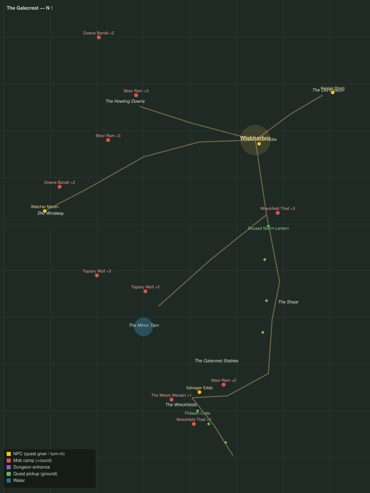

# The Galecrest

Level range: **20–20** · Hub: Wickharbor · 9 quests

_Gold = NPCs · red = mob camps (×count) · purple = dungeon entrances · green = ground pickups · blue = water._

📖 **[Bestiary for this zone](bestiary.md)** — every mob's health, armor, damage, and how to kill it.

| Lvl | Quest | Giver | Type |
|----:|-------|-------|------|
| 19 | [Down the Windway](q-gc-down-the-windway.md) | Watcher Maren | interact |
| 20 | [Wool off the Downs](q-gc-wool-off-the-downs.md) | Harbormaster Odile | collect |
| 20 | [Scuttlers in the Pots](q-gc-scuttlers-in-the-pots.md) | Harbormaster Odile | kill |
| 20 | [The Keeper of the Flame](q-gc-keeper-of-the-flame.md) | Harbormaster Odile | interact |
| 20 | [Lanterns on the Shear](q-gc-lanterns-on-the-shear.md) | Keeper Bram | interact |
| 20 | [Wind Against the Wick](q-gc-wind-against-the-wick.md) | Keeper Bram | kill |
| 20 | [The Far Shore](q-gc-the-far-shore.md) | Keeper Bram | interact |
| 20 | [Dead Men's Cargo](q-gc-dead-mens-cargo.md) | Salvager Edda | kill/interact |
| 20 | [The Wreck Warden](q-gc-the-wreck-warden.md) 👥 | Salvager Edda | kill |
