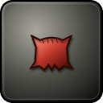
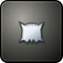
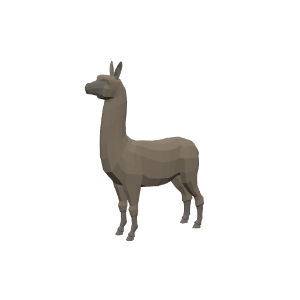
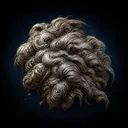
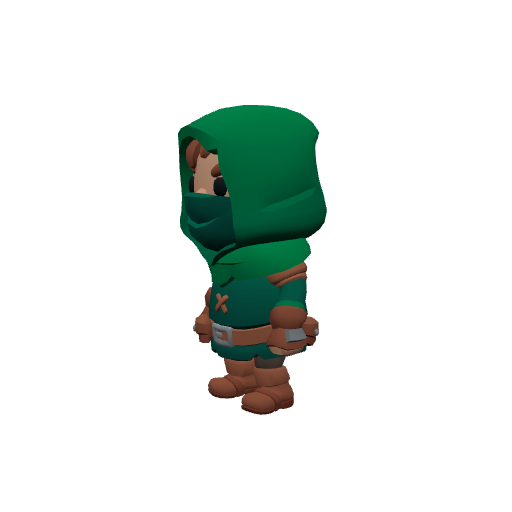
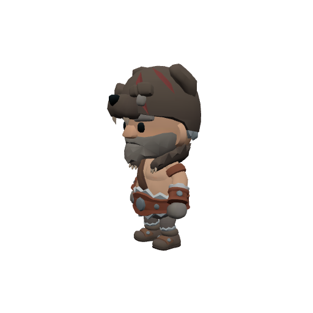

# Bestiary — The Galecrest

8 creatures you'll fight in this zone. Health/armor/damage are shown across the mob's spawn level range (mobs roll a random level within it). Mitigation % is what a same-level attacker's physical hits lose to armor — spells ignore armor.

> Threat tiers: **Boss** (dungeon, group it) · **Elite** (~2.3× HP, ~1.5× damage) · **Rare** (tough roamer) · normal (everything else).

## Common creatures

### Downs Bandit

| Stat | Value |
|---|---|
| Level | 20 |
| Family | burrower |
| Health | 394 HP |
| Armor (physical mitigation) | 190 (~8% vs a same-level attacker) |
| Melee damage | 42–66 per hit @ 1.8s swing (~30 DPS) |
| Location | The Galecrest · ~x:252, z:250 · ~x:210, z:410 — [🗺️ show on map](#/map/252/250) |

**Best way to kill:**

- Straightforward melee attacker — tank it, heal as needed, and burn it down. No special tricks.

**Loot:**

- Coins: 100 copper (always drops)

| Item | Type | Drop chance | Notes |
|---|---|---:|---|
|  ⚫ Red Bandana | Junk | 50% | sells for 6c |
|  ⚪ Linen Scrap | Junk | 30% | sells for 3c |

### Drowned Deckhand

| Stat | Value |
|---|---|
| Level | 20 |
| Family | Undead |
| Health | 419 HP |
| Armor (physical mitigation) | 247 (~11% vs a same-level attacker) |
| Melee damage | 46–72 per hit @ 2s swing (~30 DPS) |
| Location | The Galecrest |

**Best way to kill:**

- Straightforward melee attacker — tank it, heal as needed, and burn it down. No special tricks.

**Loot:**

- Coins: 100 copper (always drops)

| Item | Type | Drop chance | Notes |
|---|---|---:|---|
|  ⚪ Bone Fragments | Junk | 50% | sells for 7c |

### Gale Wisp

| Stat | Value |
|---|---|
| Level | 20 |
| Family | Elemental |
| Health | 394 HP |
| Armor (physical mitigation) | 171 (~8% vs a same-level attacker) |
| Melee damage | 45–70 per hit @ 1.9s swing (~30 DPS) |
| Location | The Galecrest |

**Best way to kill:**

- Straightforward melee attacker — tank it, heal as needed, and burn it down. No special tricks.

**Loot:**

- Coins: 105 copper (always drops)

### Moor Ram

| Stat | Value |
|---|---|
| Level | 20 |
| Family | Beast |
| Health | 419 HP |
| Armor (physical mitigation) | 247 (~11% vs a same-level attacker) |
| Melee damage | 42–66 per hit @ 2s swing (~27 DPS) |
| Location | The Galecrest · ~x:292, z:312 · ~x:262, z:360 · ~x:386, z:622 — [🗺️ show on map](#/map/292/312) |

**Best way to kill:**

- Straightforward melee attacker — tank it, heal as needed, and burn it down. No special tricks.

**Loot:**

- Coins: 105 copper (always drops)

| Item | Type | Drop chance | Notes |
|---|---|---:|---|
|   Greasy Ram Wool | Quest item | 65% | quest item — only drops while on _Wool off the Downs_ |

### Shoal Scuttler

| Stat | Value |
|---|---|
| Level | 20 |
| Family | Beast |
| Health | 417 HP |
| Armor (physical mitigation) | 266 (~11% vs a same-level attacker) |
| Melee damage | 44–68 per hit @ 2s swing (~28 DPS) |
| Location | The Galecrest |

**Best way to kill:**

- Straightforward melee attacker — tank it, heal as needed, and burn it down. No special tricks.

**Loot:**

- Coins: 105 copper (always drops)

### Topiary Wolf

| Stat | Value |
|---|---|
| Level | 20 |
| Family | Beast |
| Health | 419 HP |
| Armor (physical mitigation) | 209 (~9% vs a same-level attacker) |
| Melee damage | 45–70 per hit @ 1.9s swing (~30 DPS) |
| Location | The Galecrest · ~x:302, z:522 · ~x:250, z:505 — [🗺️ show on map](#/map/302/522) |

**Best way to kill:**

- Straightforward melee attacker — tank it, heal as needed, and burn it down. No special tricks.

**Loot:**

- Coins: 100 copper (always drops)

### Wreckfield Thief

| Stat | Value |
|---|---|
| Level | 20 |
| Family | burrower |
| Health | 394 HP |
| Armor (physical mitigation) | 190 (~8% vs a same-level attacker) |
| Melee damage | 42–66 per hit @ 1.8s swing (~30 DPS) |
| Location | The Galecrest · ~x:444, z:438 · ~x:354, z:664 — [🗺️ show on map](#/map/444/438) |

**Best way to kill:**

- Straightforward melee attacker — tank it, heal as needed, and burn it down. No special tricks.

**Loot:**

- Coins: 100 copper (always drops)

| Item | Type | Drop chance | Notes |
|---|---|---:|---|
|  ⚫ Red Bandana | Junk | 50% | sells for 6c |
|  ⚪ Linen Scrap | Junk | 30% | sells for 3c |

## Elites

### The Wreck Warden — _Elite_

| Stat | Value |
|---|---|
| Level | 20 |
| Family | Undead |
| Health | 1842 HP |
| Armor (physical mitigation) | 323 (~13% vs a same-level attacker) |
| Melee damage | 89–139 per hit @ 2.3s swing (~50 DPS) |
| Respawn | ~25s |
| Location | The Galecrest · ~x:330, z:638 — [🗺️ show on map](#/map/330/638) |

**Best way to kill:**

- **Elite** — ~2.3× the health and ~1.5× the damage of a normal mob; bring a group or out-level it.
- Straightforward melee attacker — tank it, heal as needed, and burn it down. No special tricks.

**Loot:**

- Coins: 100 copper (always drops)

| Item | Type | Drop chance | Notes |
|---|---|---:|---|
|  ⚪ Bone Fragments | Junk | 100% | sells for 7c |

---

[← Back to The Galecrest quests](README.md) · [Zone map](map.svg)
