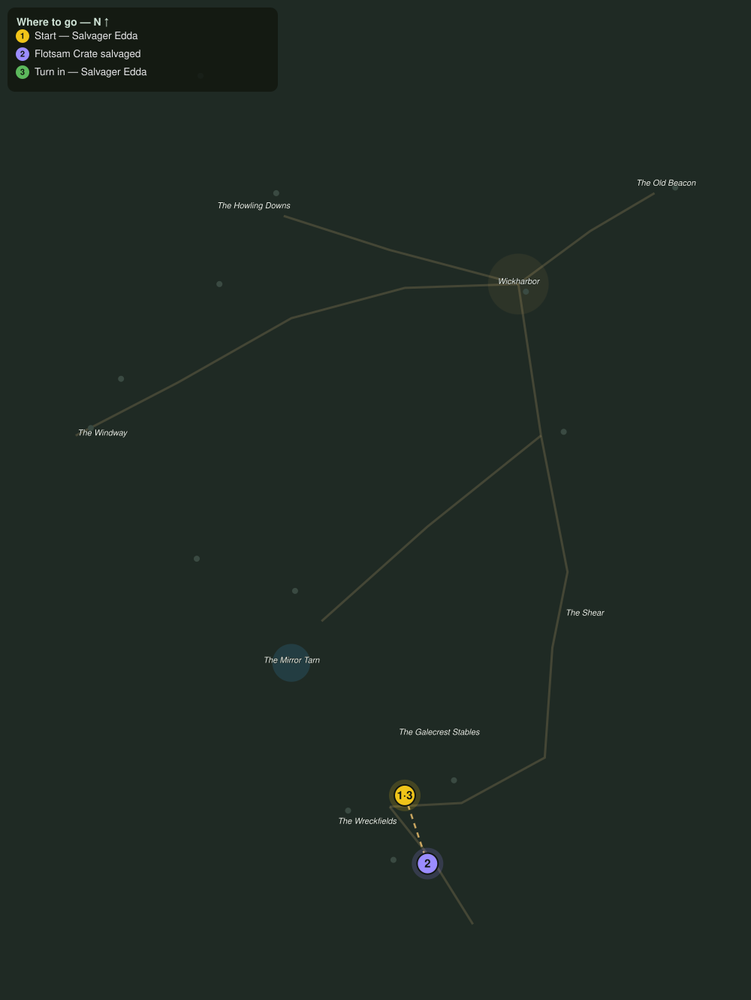

# Dead Men's Cargo

> Quest ID: `q_gc_dead_mens_cargo` · The Galecrest

| | |
|---|---|
| **Recommended level** | 20+ (zone range 20–20) |
| **Quest giver** | **Salvager Edda**, Wreckfield Salvager _(at ~x:360, z:630)_ |
| **Turn in to** | **Salvager Edda**, Wreckfield Salvager _(at ~x:360, z:630)_ |
| **Requires** | The Far Shore (`q_gc_the_far_shore`) |

## Story

> Salvage law is simple, <your name>: what the sea gives the beach is mine. The drowned deckhands disagree. They rise from their hulls and drag every crate I stack back below the tideline. Put six of them down for good, and while the beach is quiet, haul in three flotsam crates before the tide files its counterclaim.

## How to complete

- **Kill 6× [Drowned Deckhand](bestiary.md#mob-drowned_deckhand)** (level 20–20)
  - Found in the open world at ~x:352, z:662 (3 mobs, radius 10)
  - Found in the open world at ~x:306, z:618 (3 mobs, radius 9)
  - _Tracker: Drowned Deckhand laid to rest_
- **Interact 3× with Flotsam Crate**
  - Locations: ~x:358, z:650 · ~x:370, z:664 · ~x:388, z:684
  - _Tracker: Flotsam Crate salvaged_

Then return to **Salvager Edda**, Wreckfield Salvager _(at ~x:360, z:630)_ to turn in.

## Rewards

- **XP:** 5400
- **Money:** 2800 copper

## On completion

> Six crews quieter and three crates high and dry. You salvage with a heavier hand than I do, $N, but the ledger does not care. Half of this is yours by law, and by law I mean I say so.

## Leads to

- The Wreck Warden (`q_gc_the_wreck_warden`)

## Where to go

**[🧭 Open this route in 3D →](#/questroute/q_gc_dead_mens_cargo)**

_Numbered route: ① start → objectives → 4 turn in. Faint dots are the rest of the zone for context — see the [full zone map](README.md). Mob names above link to the [bestiary](bestiary.md)._
