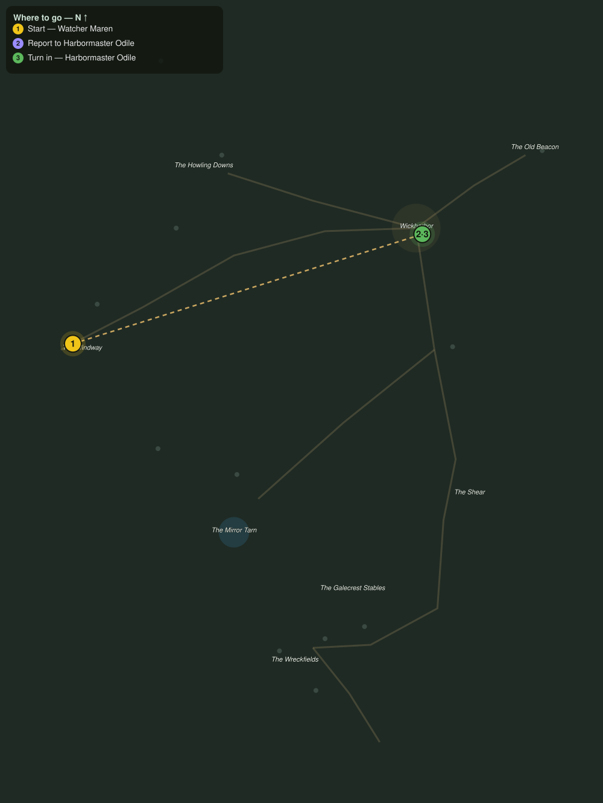

# Down the Windway

> Quest ID: `q_gc_down_the_windway` · The Galecrest

| | |
|---|---|
| **Recommended level** | 19+ |
| **Quest giver** | **Watcher Maren**, The Windway Watch _(at ~x:194, z:436)_ |
| **Turn in to** | **Harbormaster Odile**, Harbormaster of Wickharbor _(at ~x:424, z:364)_ |

## Story

> You made the climb, <your name>, so the wind has decided to keep you. Wickharbor sits east along the downs road, tucked in the lee of its cove. Harbormaster Odile counts every soul who comes over the pass, and she will want to count you. Tell her the Windway is still open.

## How to complete

- **Interact with **Harbormaster Odile**, Harbormaster of Wickharbor _(at ~x:424, z:364)_**
  - _Tracker: Report to Harbormaster Odile_

Then return to **Harbormaster Odile**, Harbormaster of Wickharbor _(at ~x:424, z:364)_ to turn in.

## Rewards

- **XP:** 2600
- **Money:** 1000 copper

## On completion

> Over the pass on foot, in this weather? Maren sends me few enough names, and fewer still walk in to answer for themselves. Welcome to Wickharbor, $N. Close the inn door behind you.

## Leads to

- Wool off the Downs (`q_gc_wool_off_the_downs`)
- Scuttlers in the Pots (`q_gc_scuttlers_in_the_pots`)

## Where to go

**[🧭 Open this route in 3D →](#/questroute/q_gc_down_the_windway)**

_Numbered route: ① start → objectives → 3 turn in. Faint dots are the rest of the zone for context — see the [full zone map](README.md). Mob names above link to the [bestiary](bestiary.md)._
