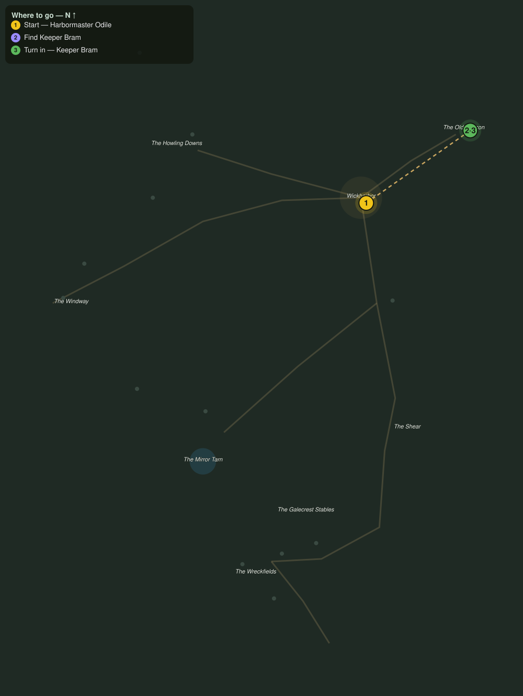

# The Keeper of the Flame

> Quest ID: `q_gc_keeper_of_the_flame` · The Galecrest

| | |
|---|---|
| **Recommended level** | 20+ |
| **Quest giver** | **Harbormaster Odile**, Harbormaster of Wickharbor _(at ~x:424, z:364)_ |
| **Turn in to** | **Keeper Bram**, Keeper of the Old Beacon _(at ~x:503, z:309)_ |
| **Requires** | Scuttlers in the Pots (`q_gc_scuttlers_in_the_pots`) |

## Story

> Old Bram keeps the Beacon on the high head northeast of town, and he has not come down for his stores in two weeks. The lamp still burns, so he lives, but a man his age alone on that head in this wind, <your name>. Climb the beacon road and see him standing.

## How to complete

- **Interact with **Keeper Bram**, Keeper of the Old Beacon _(at ~x:503, z:309)_**
  - _Tracker: Find Keeper Bram_

Then return to **Keeper Bram**, Keeper of the Old Beacon _(at ~x:503, z:309)_ to turn in.

## Rewards

- **XP:** 2600
- **Money:** 1000 copper

## On completion

> Odile sent you all this way to see if the wind had taken me? Ha. Tell her the lamp burns and so do I. But since you have made the climb, $N, stay a moment. The Beacon has work only a stranger seems fit to do.

## Leads to

- Lanterns on the Shear (`q_gc_lanterns_on_the_shear`)
- Wind Against the Wick (`q_gc_wind_against_the_wick`)

## Where to go

**[🧭 Open this route in 3D →](#/questroute/q_gc_keeper_of_the_flame)**

_Numbered route: ① start → objectives → 3 turn in. Faint dots are the rest of the zone for context — see the [full zone map](README.md). Mob names above link to the [bestiary](bestiary.md)._
