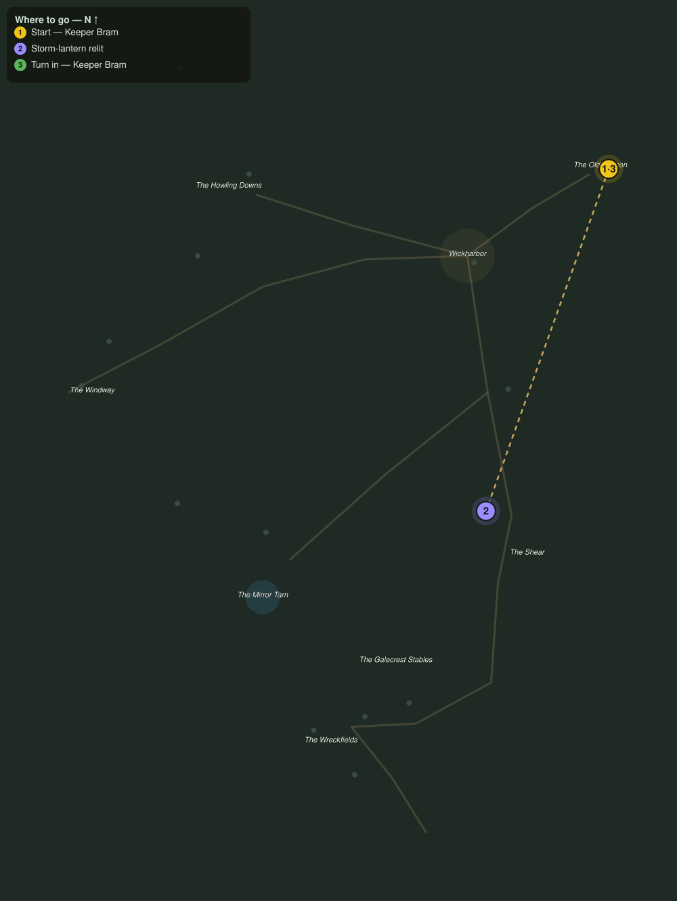

# Lanterns on the Shear

> Quest ID: `q_gc_lanterns_on_the_shear` · The Galecrest

| | |
|---|---|
| **Recommended level** | 20+ (zone range 20–20) |
| **Quest giver** | **Keeper Bram**, Keeper of the Old Beacon _(at ~x:503, z:309)_ |
| **Turn in to** | **Keeper Bram**, Keeper of the Old Beacon _(at ~x:503, z:309)_ |
| **Requires** | The Keeper of the Flame (`q_gc_keeper_of_the_flame`) |

## Story

> The Beacon is the great light, <your name>, but it is the storm-lanterns that walk a night traveler down the cliff road above the Shear. Last night the gale doused every one of them, and that road in the dark is a long fall with a short ending. Take my striker and relight the four along the cliff.

## How to complete

- **Interact 4× with Doused Storm-Lantern**
  - Locations: ~x:434, z:452 · ~x:430, z:488 · ~x:432, z:532 · ~x:428, z:566
  - _Tracker: Storm-lantern relit_

Then return to **Keeper Bram**, Keeper of the Old Beacon _(at ~x:503, z:309)_ to turn in.

## Rewards

- **XP:** 4800
- **Money:** 2200 copper

## On completion

> Four points of light on the cliff road, right where they belong. From up here it looks like the coast has opened its eyes again. You have the makings of a keeper, $N.

## Leads to

- The Far Shore (`q_gc_the_far_shore`)

## Where to go

**[🧭 Open this route in 3D →](#/questroute/q_gc_lanterns_on_the_shear)**

_Numbered route: ① start → objectives → 3 turn in. Faint dots are the rest of the zone for context — see the [full zone map](README.md). Mob names above link to the [bestiary](bestiary.md)._
