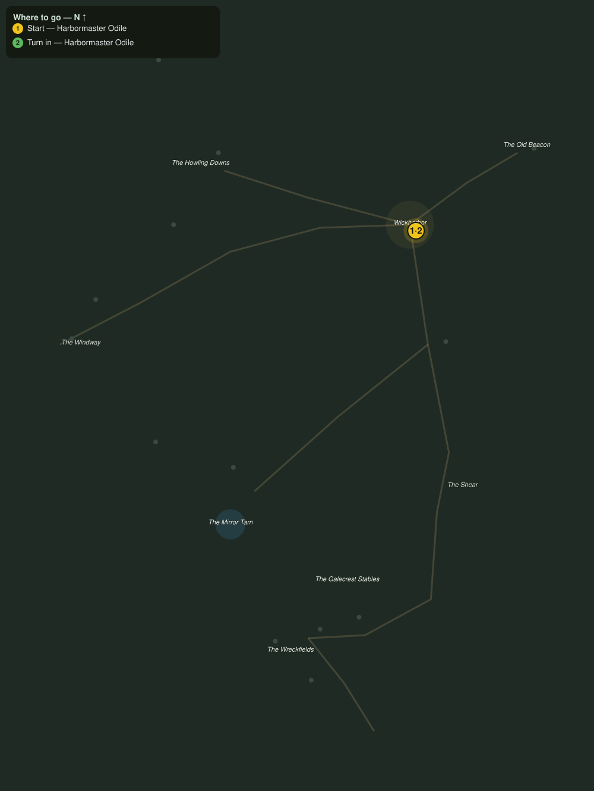

# Scuttlers in the Pots

> Quest ID: `q_gc_scuttlers_in_the_pots` · The Galecrest

| | |
|---|---|
| **Recommended level** | 20+ (zone range 20–20) |
| **Quest giver** | **Harbormaster Odile**, Harbormaster of Wickharbor _(at ~x:424, z:364)_ |
| **Turn in to** | **Harbormaster Odile**, Harbormaster of Wickharbor _(at ~x:424, z:364)_ |
| **Requires** | Down the Windway (`q_gc_down_the_windway`) |

## Story

> The shoal scuttlers have learned to climb the cliff road and crack our crab pots open on the stones, <your name>. Half the catch gone this week, and one potman with a hand he will not be using for a month. Break ten of them and the rest will remember why they kept to the shoals.

## How to complete

- **Kill 10× [Shoal Scuttler](bestiary.md#mob-shoal_scuttler)** (level 20–20)
  - Found in the open world at ~x:410, z:400 (5 mobs, radius 9)
  - Found in the open world at ~x:440, z:460 (5 mobs, radius 8)
  - _Tracker: Shoal Scuttler slain_

Then return to **Harbormaster Odile**, Harbormaster of Wickharbor _(at ~x:424, z:364)_ to turn in.

## Rewards

- **XP:** 4600
- **Money:** 2400 copper

## On completion

> Ten fewer shells on my road, and the pots came up full this morning. The potmen are calling you a good omen, $N. In Wickharbor that is as warm as praise gets.

## Leads to

- The Keeper of the Flame (`q_gc_keeper_of_the_flame`)

## Where to go

**[🧭 Open this route in 3D →](#/questroute/q_gc_scuttlers_in_the_pots)**

_Numbered route: ① start → objectives → 3 turn in. Faint dots are the rest of the zone for context — see the [full zone map](README.md). Mob names above link to the [bestiary](bestiary.md)._
