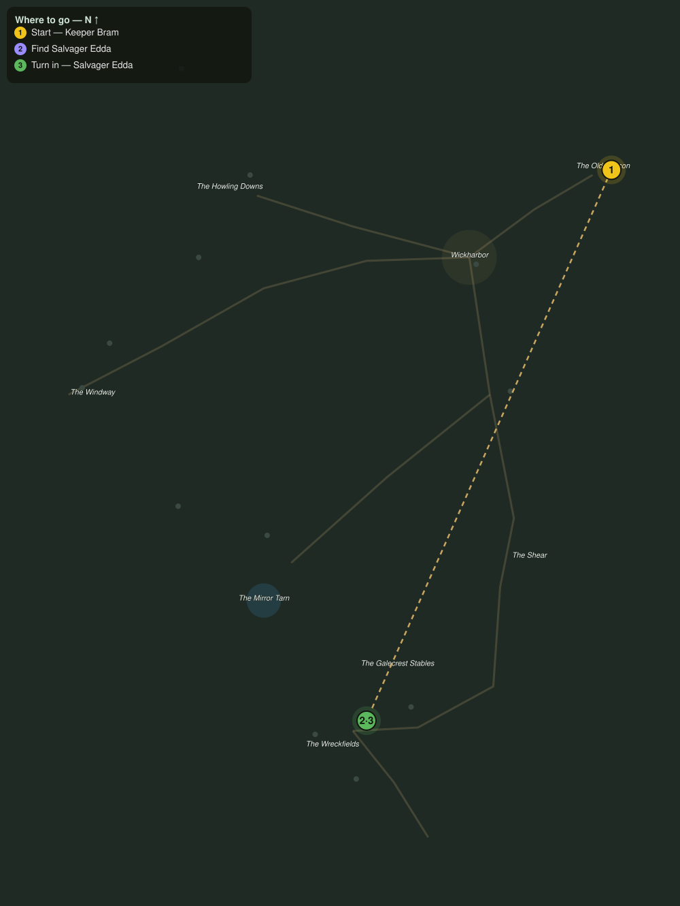

# The Far Shore

> Quest ID: `q_gc_the_far_shore` · The Galecrest

| | |
|---|---|
| **Recommended level** | 20+ |
| **Quest giver** | **Keeper Bram**, Keeper of the Old Beacon _(at ~x:503, z:309)_ |
| **Turn in to** | **Salvager Edda**, Wreckfield Salvager _(at ~x:360, z:630)_ |
| **Requires** | Lanterns on the Shear (`q_gc_lanterns_on_the_shear`) |

## Story

> From this lamp room I can see the whole coast, <your name>, and what I see in the north I do not like. Green lights walking the Wreckfields at low tide, hull by hull. One woman works that shore alone: Edda, the salvager. Follow the cliff road north past the Shear until the wrecks begin, and see that she still draws breath.

## How to complete

- **Interact with **Salvager Edda**, Wreckfield Salvager _(at ~x:360, z:630)_**
  - _Tracker: Find Salvager Edda_

Then return to **Salvager Edda**, Wreckfield Salvager _(at ~x:360, z:630)_ to turn in.

## Rewards

- **XP:** 2800
- **Money:** 1100 copper

## On completion

> Bram watches my shore from his tower now, does he? The old man is right to worry, $N. The dead have been walking their own wrecks at night, and lately they have stopped caring whether the sun is up.

## Leads to

- Dead Men's Cargo (`q_gc_dead_mens_cargo`)

## Where to go

**[🧭 Open this route in 3D →](#/questroute/q_gc_the_far_shore)**

_Numbered route: ① start → objectives → 3 turn in. Faint dots are the rest of the zone for context — see the [full zone map](README.md). Mob names above link to the [bestiary](bestiary.md)._
