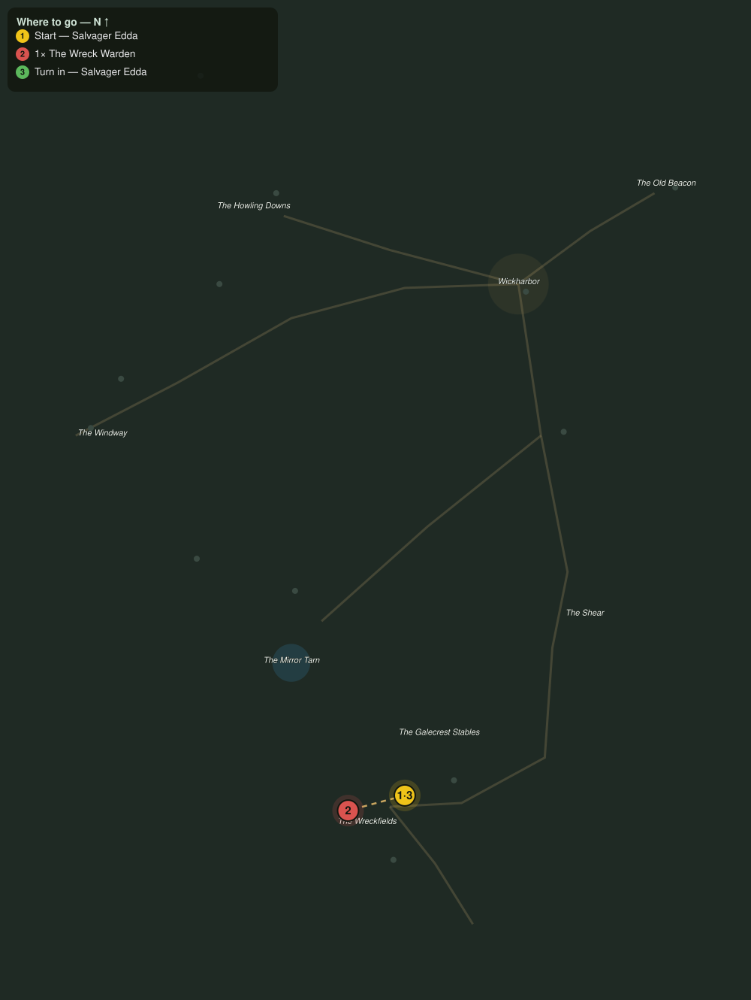

# The Wreck Warden

> Quest ID: `q_gc_the_wreck_warden` · The Galecrest

| | |
|---|---|
| **Recommended level** | 20+ |
| **Quest giver** | **Salvager Edda**, Wreckfield Salvager _(at ~x:360, z:630)_ |
| **Turn in to** | **Salvager Edda**, Wreckfield Salvager _(at ~x:360, z:630)_ |
| **Requires** | Dead Men's Cargo (`q_gc_dead_mens_cargo`) |
| **Group quest** | 👥 Suggested players: 2 |

## Story

> Now you know why the deckhands rise, <your name>. Something wears the barnacled plate of the first wreck ever to break on this shore, and it wardens every hull on the beach like a graveyard it was hired to keep. It holds a hoard I have coveted for ten years and a crew I would rather see resting. End the Wreck Warden. Bring a friend, the dead keep good watch.

## How to complete

- **Kill 1× [The Wreck Warden](bestiary.md#mob-the_wreck_warden)** (level 20–20, **Elite**)
  - Found in the open world at ~x:330, z:638 (1 mob, radius 5)
  - _Tracker: The Wreck Warden felled_

Then return to **Salvager Edda**, Wreckfield Salvager _(at ~x:360, z:630)_ to turn in.

## Rewards

- **XP:** 6200
- **Money:** 3800 copper
- **Item reward (by class):**
  -  🔵 Mantle of the Wreck Warden — _warrior, mage, rogue_ · 76 armor, +4 Str, +6 Sta

## On completion

> The beach went silent the moment it fell, $N. First silence I have heard on this shore in ten years of working it. The crews are just bones now, resting bones. Take the mantle off the top of the hoard, it was always going to fit a living back better.

## Where to go

**[🧭 Open this route in 3D →](#/questroute/q_gc_the_wreck_warden)**

_Numbered route: ① start → objectives → 3 turn in. Faint dots are the rest of the zone for context — see the [full zone map](README.md). Mob names above link to the [bestiary](bestiary.md)._
