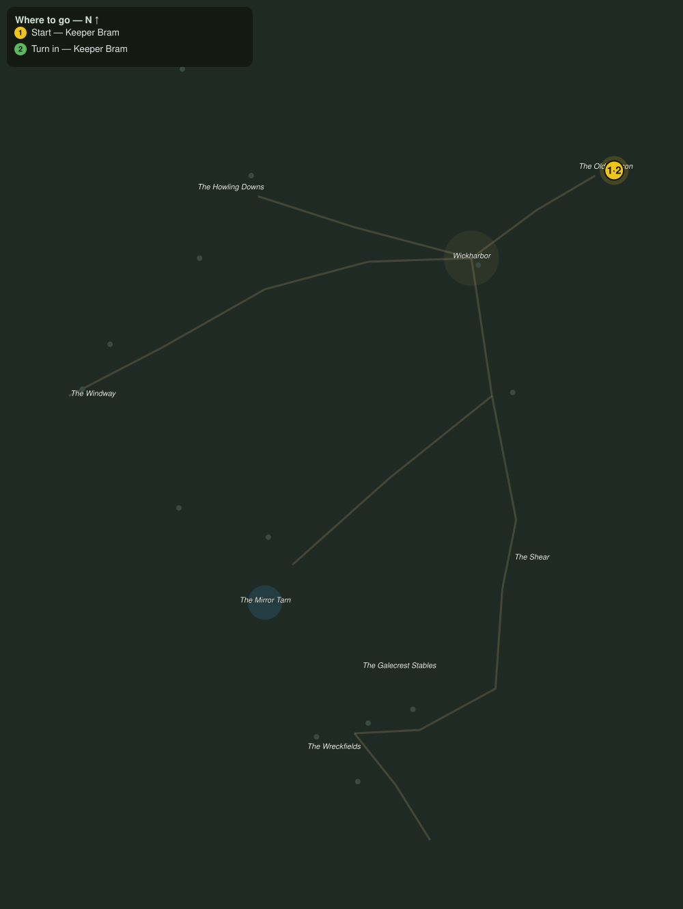

# Wind Against the Wick

> Quest ID: `q_gc_wind_against_the_wick` · The Galecrest

| | |
|---|---|
| **Recommended level** | 20+ (zone range 20–20) |
| **Quest giver** | **Keeper Bram**, Keeper of the Old Beacon _(at ~x:503, z:309)_ |
| **Turn in to** | **Keeper Bram**, Keeper of the Old Beacon _(at ~x:503, z:309)_ |
| **Requires** | The Keeper of the Flame (`q_gc_keeper_of_the_flame`) |

## Story

> The gale wisps are the wind gone spiteful, <your name>. They gather on the high downs by the Mirror Tarn, and every flame they find, they snuff, a lantern, a hearth, one day this lamp. Thirty-nine years I have kept the Beacon lit, and I will not lose it to weather with a grudge. Scatter eight of them.

## How to complete

- **Kill 8× [Gale Wisp](bestiary.md#mob-gale_wisp)** (level 20–20)
  - _Spawns as part of a scripted encounter_
  - _Tracker: Gale Wisp scattered_

Then return to **Keeper Bram**, Keeper of the Old Beacon _(at ~x:503, z:309)_ to turn in.

## Rewards

- **XP:** 5000
- **Money:** 2600 copper

## On completion

> The lamp did not so much as gutter last night, first time in a month. The wind still hates us, $N, but it has gone back to hating us fairly.

## Where to go

**[🧭 Open this route in 3D →](#/questroute/q_gc_wind_against_the_wick)**

_Numbered route: ① start → objectives → 3 turn in. Faint dots are the rest of the zone for context — see the [full zone map](README.md). Mob names above link to the [bestiary](bestiary.md)._
