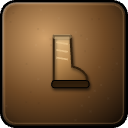
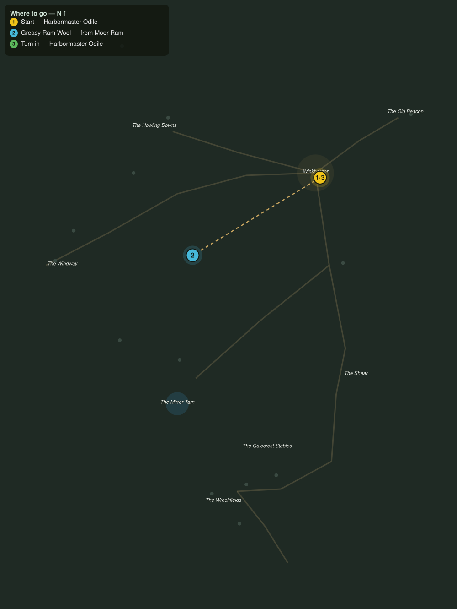

# Wool off the Downs

> Quest ID: `q_gc_wool_off_the_downs` · The Galecrest

| | |
|---|---|
| **Recommended level** | 20+ (zone range 20–20) |
| **Quest giver** | **Harbormaster Odile**, Harbormaster of Wickharbor _(at ~x:424, z:364)_ |
| **Turn in to** | **Harbormaster Odile**, Harbormaster of Wickharbor _(at ~x:424, z:364)_ |
| **Requires** | Down the Windway (`q_gc_down_the_windway`) |

## Story

> My boat crews row into a gale that cuts through oilskin like paper, <your name>. Only one thing turns this wind: the greasy wool off the moor rams, spun thick the Wickharbor way. The herds graze the Howling Downs west of town. Six good fleeces and every crew rows warm this season.

## How to complete

- **Collect 6× Greasy Ram Wool**
  - Drops from [**Moor Ram**](bestiary.md#mob-moor_ram) (65% chance) — Found in the open world at ~x:292, z:312 (3 mobs, radius 11); Found in the open world at ~x:262, z:360 (3 mobs, radius 10); Found in the open world at ~x:386, z:622 (2 mobs, radius 9)
  - _Tracker: Greasy Ram Wool_

Then return to **Harbormaster Odile**, Harbormaster of Wickharbor _(at ~x:424, z:364)_ to turn in.

## Rewards

- **XP:** 4600
- **Money:** 2200 copper
- **Item reward (by class):**
  -  🟢 Wickspun Treads — _warrior, mage, rogue_ · 62 armor, +3 Sta, +2 Spi

## On completion

> Fleece like this is why the rams stand out there fat and smug in weather that kills men. The spinners will be at it by lamplight. Take these treads, $N, they are lined from the last shearing.

## Where to go

**[🧭 Open this route in 3D →](#/questroute/q_gc_wool_off_the_downs)**

_Numbered route: ① start → objectives → 3 turn in. Faint dots are the rest of the zone for context — see the [full zone map](README.md). Mob names above link to the [bestiary](bestiary.md)._
