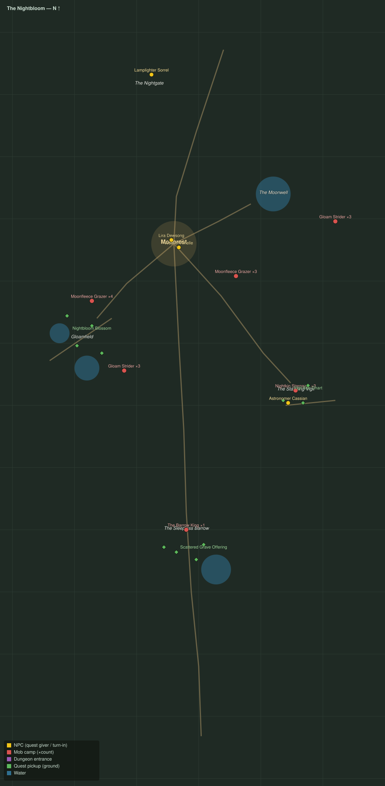

# The Nightbloom

Level range: **20–20** · Hub: Moonrest · 8 quests

_Gold = NPCs · red = mob camps (×count) · purple = dungeon entrances · green = ground pickups · blue = water._

📖 **[Bestiary for this zone](bestiary.md)** — every mob's health, armor, damage, and how to kill it.

| Lvl | Quest | Giver | Type |
|----:|-------|-------|------|
| 19 | [The Road of Lanterns](q-nb-road-of-lanterns.md) | Lamplighter Sorrel | interact |
| 20 | [Striders in the Dark](q-nb-striders-in-the-dark.md) | Lira Dewsong | kill |
| 20 | [Wool by Moonlight](q-nb-wool-by-moonlight.md) | Weaver Amelle | collect |
| 20 | [The Night Gardens](q-nb-night-gardens.md) | Lira Dewsong | interact |
| 20 | [Eyes on the Vigil](q-nb-eyes-on-the-vigil.md) | Lira Dewsong | interact |
| 20 | [The Charts in the Stones](q-nb-charts-of-the-stones.md) | Astronomer Cassian | interact |
| 20 | [The Restless Mounds](q-nb-restless-mounds.md) | Astronomer Cassian | kill/interact |
| 20 | [The Barrow King Wakes](q-nb-the-barrow-king.md) 👥 | Astronomer Cassian | kill |
