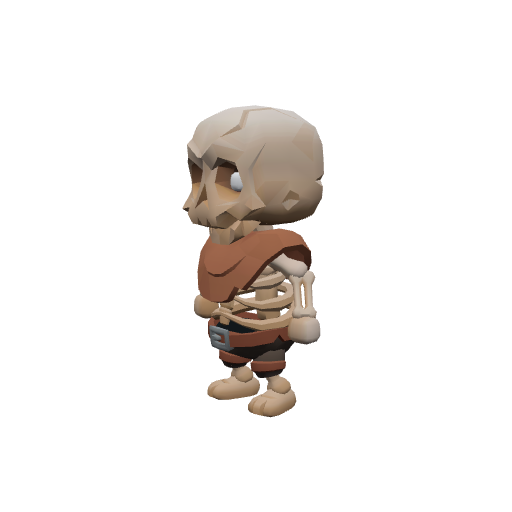
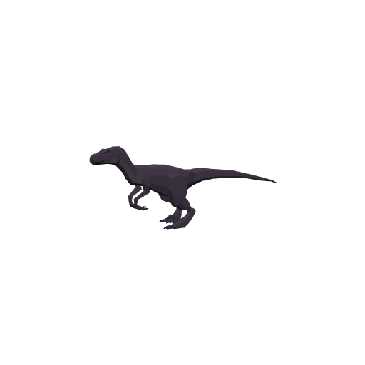
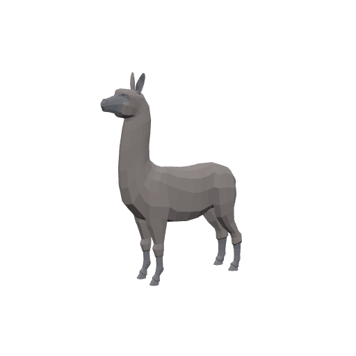
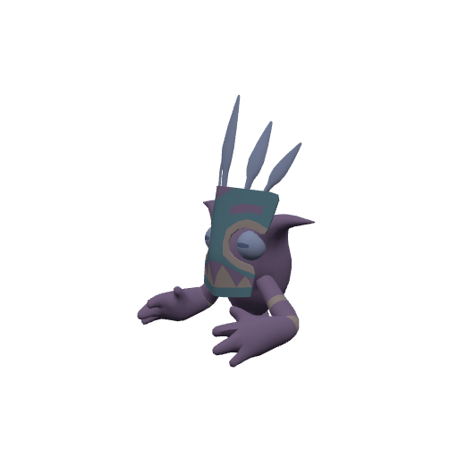
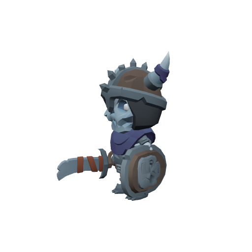

# Bestiary — The Nightbloom

5 creatures you'll fight in this zone. Health/armor/damage are shown across the mob's spawn level range (mobs roll a random level within it). Mitigation % is what a same-level attacker's physical hits lose to armor — spells ignore armor.

> Threat tiers: **Boss** (dungeon, group it) · **Elite** (~2.3× HP, ~1.5× damage) · **Rare** (tough roamer) · normal (everything else).

## Common creatures

### Barrow Wight

| Stat | Value |
|---|---|
| Level | 20 |
| Family | Undead |
| Health | 488 HP |
| Armor (physical mitigation) | 266 (~11% vs a same-level attacker) |
| Melee damage | 48–76 per hit @ 2.1s swing (~30 DPS) |
| Location | The Nightbloom |

**Best way to kill:**

- Straightforward melee attacker — tank it, heal as needed, and burn it down. No special tricks.

**Loot:**

- Coins: 110 copper (always drops)

| Item | Type | Drop chance | Notes |
|---|---|---:|---|
|  ⚪ Bone Fragments | Junk | 50% | sells for 7c |

### Gloam Strider

| Stat | Value |
|---|---|
| Level | 20 |
| Family | Beast |
| Health | 438 HP |
| Armor (physical mitigation) | 228 (~10% vs a same-level attacker) |
| Melee damage | 46–72 per hit @ 1.8s swing (~33 DPS) |
| Location | The Nightbloom · ~x:-410, z:1522 · ~x:-240, z:1402 — [🗺️ show on map](#/map/-410/1522) |

**Best way to kill:**

- Straightforward melee attacker — tank it, heal as needed, and burn it down. No special tricks.

**Loot:**

- Coins: 105 copper (always drops)

### Moonfleece Grazer

| Stat | Value |
|---|---|
| Level | 20 |
| Family | Beast |
| Health | 440 HP |
| Armor (physical mitigation) | 228 (~10% vs a same-level attacker) |
| Melee damage | 41–65 per hit @ 2.1s swing (~25 DPS) |
| Location | The Nightbloom · ~x:-436, z:1466 · ~x:-320, z:1446 — [🗺️ show on map](#/map/-436/1466) |

**Best way to kill:**

- Straightforward melee attacker — tank it, heal as needed, and burn it down. No special tricks.

**Loot:**

- Coins: 105 copper (always drops)

| Item | Type | Drop chance | Notes |
|---|---|---:|---|
|   Moonfleece Tuft | Quest item | 60% | quest item — only drops while on _Wool by Moonlight_ |

### Nightkin Stargazer

| Stat | Value |
|---|---|
| Level | 20 |
| Family | Elemental |
| Health | 396 HP |
| Armor (physical mitigation) | 209 (~9% vs a same-level attacker) |
| Melee damage | 41–65 per hit @ 2s swing (~27 DPS) |
| Location | The Nightbloom · ~x:-272, z:1538 — [🗺️ show on map](#/map/-272/1538) |

**Best way to kill:**

- Straightforward melee attacker — tank it, heal as needed, and burn it down. No special tricks.

**Loot:**

- Coins: 110 copper (always drops)

## Elites

### The Barrow King — _Elite_

| Stat | Value |
|---|---|
| Level | 20 |
| Family | Undead |
| Health | 1831 HP |
| Armor (physical mitigation) | 323 (~13% vs a same-level attacker) |
| Melee damage | 89–139 per hit @ 2.4s swing (~48 DPS) |
| Respawn | ~25s |
| Location | The Nightbloom · ~x:-360, z:1650 — [🗺️ show on map](#/map/-360/1650) |

**Best way to kill:**

- **Elite** — ~2.3× the health and ~1.5× the damage of a normal mob; bring a group or out-level it.
- Straightforward melee attacker — tank it, heal as needed, and burn it down. No special tricks.

**Loot:**

- Coins: 450 copper (always drops)

| Item | Type | Drop chance | Notes |
|---|---|---:|---|
|  ⚪ Bone Fragments | Junk | 100% | sells for 7c |

---

[← Back to The Nightbloom quests](README.md) · [Zone map](map.svg)
