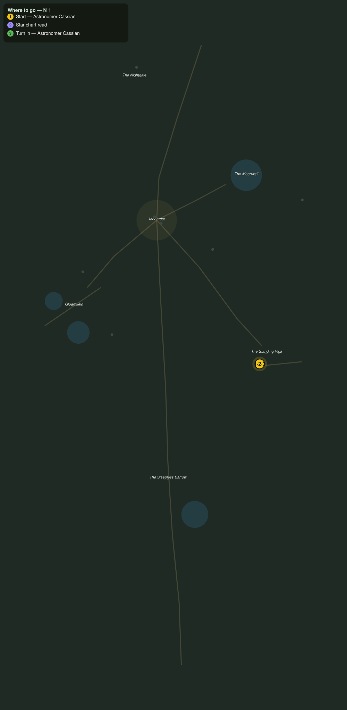

# The Charts in the Stones

> Quest ID: `q_nb_charts_of_the_stones` · The Nightbloom

| | |
|---|---|
| **Recommended level** | 20+ (zone range 20–20) |
| **Quest giver** | **Astronomer Cassian**, Watcher at the Vigil _(at ~x:-278, z:1548)_ |
| **Turn in to** | **Astronomer Cassian**, Watcher at the Vigil _(at ~x:-278, z:1548)_ |
| **Requires** | Eyes on the Vigil (`q_nb_eyes_on_the_vigil`) |

## Story

> The Vigil stones are older than Moonrest, older than the nightkin who tend them, and their faces are cut with star charts I have spent my life learning to read. The sky has shifted, <your name>, and I must know how far. Read the charts on three of the stones and bring me their bearings.

## How to complete

- **Interact 3× with Vigil Star Chart**
  - Locations: ~x:-262, z:1534 · ~x:-282, z:1546 · ~x:-266, z:1548
  - _Tracker: Star chart read_

Then return to **Astronomer Cassian**, Watcher at the Vigil _(at ~x:-278, z:1548)_ to turn in.

## Rewards

- **XP:** 5000
- **Money:** 2400 copper

## On completion

> No doubt is left. Every bearing has crept toward the Sleepless Barrow, as if the sky itself leans over that mound to watch. The old kings were buried under aligned stars for a reason, $N.

## Leads to

- The Restless Mounds (`q_nb_restless_mounds`)

## Where to go

**[🧭 Open this route in 3D →](#/questroute/q_nb_charts_of_the_stones)**

_Numbered route: ① start → objectives → 3 turn in. Faint dots are the rest of the zone for context — see the [full zone map](README.md). Mob names above link to the [bestiary](bestiary.md)._
