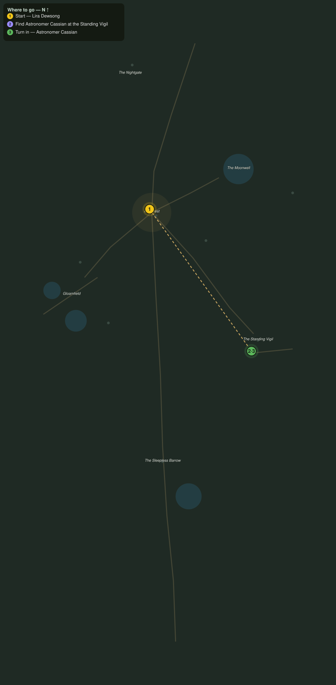

# Eyes on the Vigil

> Quest ID: `q_nb_eyes_on_the_vigil` · The Nightbloom

| | |
|---|---|
| **Recommended level** | 20+ |
| **Quest giver** | **Lira Dewsong**, Night-Gardener of Moonrest _(at ~x:-372, z:1417)_ |
| **Turn in to** | **Astronomer Cassian**, Watcher at the Vigil _(at ~x:-278, z:1548)_ |
| **Requires** | Striders in the Dark (`q_nb_striders_in_the_dark`) |

## Story

> Something has the striders bold and the herds uneasy, <your name>, and I cannot read it in the flowers. Cassian can read it in the sky. He keeps his observatory camp by the Standing Vigil east of here, where the nightkin drift among the stones. Find him, and ask what the stars are saying.

## How to complete

- **Interact with **Astronomer Cassian**, Watcher at the Vigil _(at ~x:-278, z:1548)_**
  - _Tracker: Find Astronomer Cassian at the Standing Vigil_

Then return to **Astronomer Cassian**, Watcher at the Vigil _(at ~x:-278, z:1548)_ to turn in.

## Rewards

- **XP:** 2800
- **Money:** 1050 copper

## On completion

> Lira sent you? Then the gardens feel it too. Sit by the glass a moment, $N. The stars have been restless for a month, and every chart I draw leans north toward the barrow.

## Leads to

- The Charts in the Stones (`q_nb_charts_of_the_stones`)

## Where to go

**[🧭 Open this route in 3D →](#/questroute/q_nb_eyes_on_the_vigil)**

_Numbered route: ① start → objectives → 3 turn in. Faint dots are the rest of the zone for context — see the [full zone map](README.md). Mob names above link to the [bestiary](bestiary.md)._
