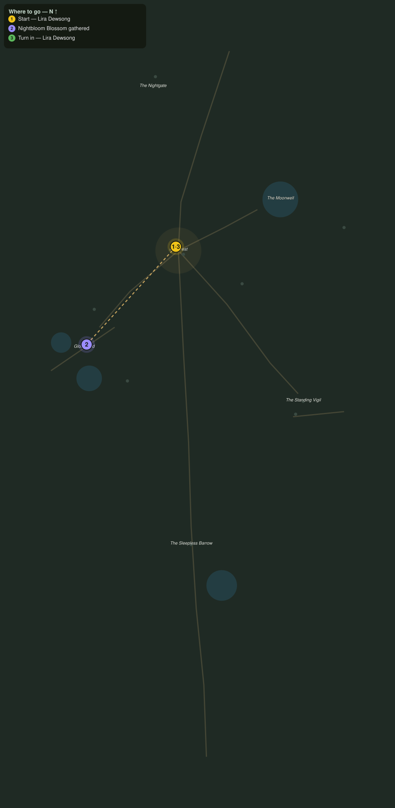

# The Night Gardens

> Quest ID: `q_nb_night_gardens` · The Nightbloom

| | |
|---|---|
| **Recommended level** | 20+ (zone range 20–20) |
| **Quest giver** | **Lira Dewsong**, Night-Gardener of Moonrest _(at ~x:-372, z:1417)_ |
| **Turn in to** | **Lira Dewsong**, Night-Gardener of Moonrest _(at ~x:-372, z:1417)_ |
| **Requires** | The Road of Lanterns (`q_nb_road_of_lanterns`) |

## Story

> The nightbloom opens only under this sky, and Gloamfield holds the oldest beds in the realm. I need four fresh blossoms for the shrine garlands, <your name>. Cut them gently: a bed remembers a rough hand for a season.

## How to complete

- **Interact 4× with Nightbloom Blossom**
  - Locations: ~x:-436, z:1486 · ~x:-448, z:1502 · ~x:-428, z:1508 · ~x:-456, z:1478
  - _Tracker: Nightbloom Blossom gathered_

Then return to **Lira Dewsong**, Night-Gardener of Moonrest _(at ~x:-372, z:1417)_ to turn in.

## Rewards

- **XP:** 4800
- **Money:** 2200 copper

## On completion

> Still glowing, every petal. The shrine will smell of night for a week, and Moonrest sleeps easier for it.

## Where to go

**[🧭 Open this route in 3D →](#/questroute/q_nb_night_gardens)**

_Numbered route: ① start → objectives → 3 turn in. Faint dots are the rest of the zone for context — see the [full zone map](README.md). Mob names above link to the [bestiary](bestiary.md)._
