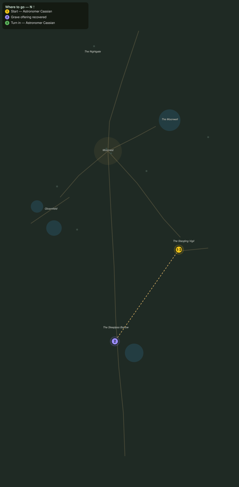

# The Restless Mounds

> Quest ID: `q_nb_restless_mounds` · The Nightbloom

| | |
|---|---|
| **Recommended level** | 20+ |
| **Quest giver** | **Astronomer Cassian**, Watcher at the Vigil _(at ~x:-278, z:1548)_ |
| **Turn in to** | **Astronomer Cassian**, Watcher at the Vigil _(at ~x:-278, z:1548)_ |
| **Requires** | The Charts in the Stones (`q_nb_charts_of_the_stones`) |

## Story

> The charts were a warning, and the barrow field proves it: the mounds are opening from beneath. Wights walk the grave rows wearing the old honors, and the offerings that kept them sleeping lie scattered in the grass. Put eight of them down, <your name>, and gather four of the offerings back to me.

## How to complete

- **Kill 8× [Barrow Wight](bestiary.md#mob-barrow_wight)** (level 20–20)
  - Found in the open world at ~x:-326, z:1660 (3 mobs, radius 9)
  - Found in the open world at ~x:-382, z:1636 (3 mobs, radius 9)
  - _Tracker: Barrow Wight slain_
- **Interact 4× with Scattered Grave Offering**
  - Locations: ~x:-346, z:1662 · ~x:-378, z:1664 · ~x:-352, z:1674 · ~x:-368, z:1668
  - _Tracker: Grave offering recovered_

Then return to **Astronomer Cassian**, Watcher at the Vigil _(at ~x:-278, z:1548)_ to turn in.

## Rewards

- **XP:** 5400
- **Money:** 2800 copper

## On completion

> Grave gold, still cold from the soil. The wights are not rising on their own, $N: something beneath the great mound is calling them out, and I fear the charts have already told us its name.

## Leads to

- The Barrow King Wakes (`q_nb_the_barrow_king`)

## Where to go

**[🧭 Open this route in 3D →](#/questroute/q_nb_restless_mounds)**

_Numbered route: ① start → objectives → 4 turn in. Faint dots are the rest of the zone for context — see the [full zone map](README.md). Mob names above link to the [bestiary](bestiary.md)._
