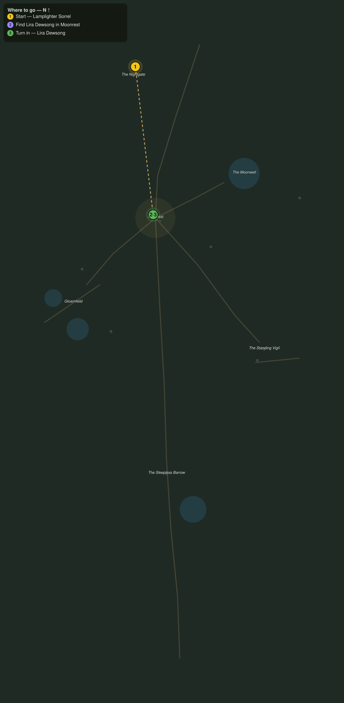

# The Road of Lanterns

> Quest ID: `q_nb_road_of_lanterns` · The Nightbloom

| | |
|---|---|
| **Recommended level** | 19+ |
| **Quest giver** | **Lamplighter Sorrel**, Keeper of the Nightgate _(at ~x:-388, z:1284)_ |
| **Turn in to** | **Lira Dewsong**, Night-Gardener of Moonrest _(at ~x:-372, z:1417)_ |

## Story

> Up here the sun never follows, <your name>, only the lamps I keep lit along the climb. Moonrest lies north where the flower-light gathers. Find Lira Dewsong among her gardens and tell her the Nightgate lamps still burn.

## How to complete

- **Interact with **Lira Dewsong**, Night-Gardener of Moonrest _(at ~x:-372, z:1417)_**
  - _Tracker: Find Lira Dewsong in Moonrest_

Then return to **Lira Dewsong**, Night-Gardener of Moonrest _(at ~x:-372, z:1417)_ to turn in.

## Rewards

- **XP:** 2600
- **Money:** 950 copper

## On completion

> The lamps still burn, and the road still carries strangers to us. Sorrel has kept that gate longer than anyone in Moonrest remembers. Welcome, $N, to the realm that never dawns.

## Leads to

- Striders in the Dark (`q_nb_striders_in_the_dark`)
- Wool by Moonlight (`q_nb_wool_by_moonlight`)
- The Night Gardens (`q_nb_night_gardens`)

## Where to go

**[🧭 Open this route in 3D →](#/questroute/q_nb_road_of_lanterns)**

_Numbered route: ① start → objectives → 3 turn in. Faint dots are the rest of the zone for context — see the [full zone map](README.md). Mob names above link to the [bestiary](bestiary.md)._
