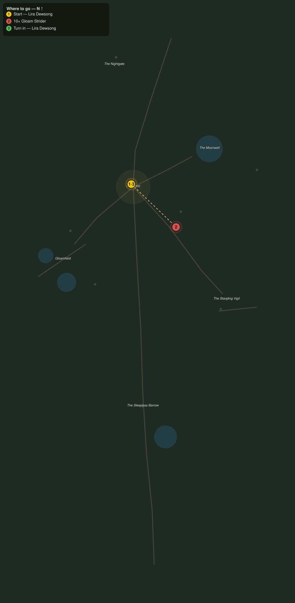

# Striders in the Dark

> Quest ID: `q_nb_striders_in_the_dark` · The Nightbloom

| | |
|---|---|
| **Recommended level** | 20+ (zone range 20–20) |
| **Quest giver** | **Lira Dewsong**, Night-Gardener of Moonrest _(at ~x:-372, z:1417)_ |
| **Turn in to** | **Lira Dewsong**, Night-Gardener of Moonrest _(at ~x:-372, z:1417)_ |
| **Requires** | The Road of Lanterns (`q_nb_road_of_lanterns`) |

## Story

> The gloam striders were always patient hunters, <your name>, but of late they slip right into the flower beds and take moonfleece lambs beneath our lanterns. Cull ten of them and give the downs back their quiet.

## How to complete

- **Kill 10× [Gloam Strider](bestiary.md#mob-gloam_strider)** (level 20–20)
  - Found in the open world at ~x:-410, z:1522 (3 mobs, radius 10)
  - Found in the open world at ~x:-240, z:1402 (3 mobs, radius 10)
  - _Tracker: Gloam Strider slain_

Then return to **Lira Dewsong**, Night-Gardener of Moonrest _(at ~x:-372, z:1417)_ to turn in.

## Rewards

- **XP:** 4600
- **Money:** 2200 copper

## On completion

> Ten striders fewer, and the herds already graze easier. The gardens keep their own hours, but tonight they keep them in peace.

## Leads to

- Eyes on the Vigil (`q_nb_eyes_on_the_vigil`)

## Where to go

**[🧭 Open this route in 3D →](#/questroute/q_nb_striders_in_the_dark)**

_Numbered route: ① start → objectives → 3 turn in. Faint dots are the rest of the zone for context — see the [full zone map](README.md). Mob names above link to the [bestiary](bestiary.md)._
