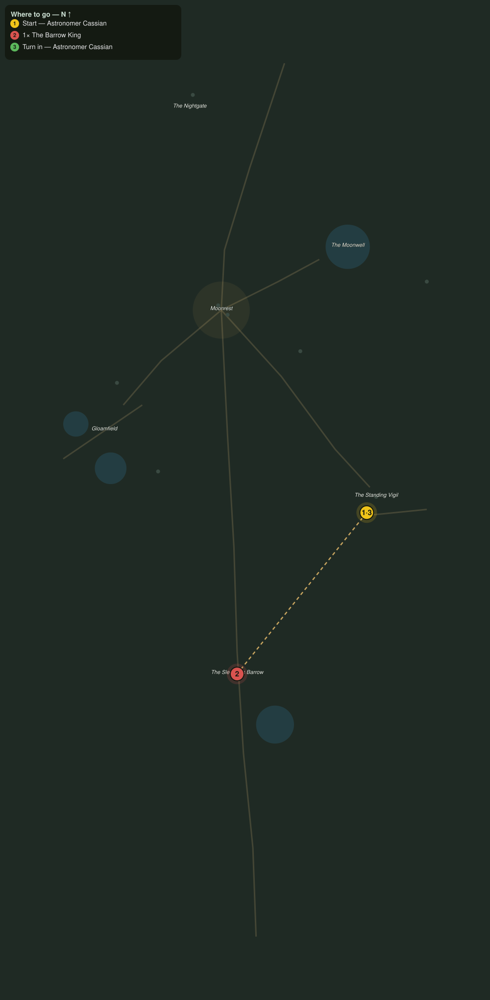

# The Barrow King Wakes

> Quest ID: `q_nb_the_barrow_king` · The Nightbloom

| | |
|---|---|
| **Recommended level** | 20+ |
| **Quest giver** | **Astronomer Cassian**, Watcher at the Vigil _(at ~x:-278, z:1548)_ |
| **Turn in to** | **Astronomer Cassian**, Watcher at the Vigil _(at ~x:-278, z:1548)_ |
| **Requires** | The Restless Mounds (`q_nb_restless_mounds`) |
| **Group quest** | 👥 Suggested players: 2 |

## Story

> Every bearing, every restless star, every opened mound points to one thing: the Barrow King is waking beneath the great mound, and this realm has no dawn to hold him back. He must be put to rest before he remembers his crown, <your name>. Do not go alone: bring a friend, and keep the flower-light at your back.

## How to complete

- **Kill 1× [The Barrow King](bestiary.md#mob-barrow_king)** (level 20–20, **Elite**)
  - Found in the open world at ~x:-360, z:1650 (1 mob, radius 5)
  - _Tracker: The Barrow King put to rest_

Then return to **Astronomer Cassian**, Watcher at the Vigil _(at ~x:-278, z:1548)_ to turn in.

## Rewards

- **XP:** 6200
- **Money:** 3800 copper
- **Item reward (by class):**
  -  🔵 Barrowshade Mantle — _warrior, mage, rogue_ · 76 armor, +6 Sta, +4 Spi

## On completion

> The stars have settled for the first time in a season, $N. The mounds are closed, the nightkin have gone still at their stones, and the king sleeps below once more. Wear this mantle: Moonrest cut it for whoever the night finally trusted.

## Where to go

**[🧭 Open this route in 3D →](#/questroute/q_nb_the_barrow_king)**

_Numbered route: ① start → objectives → 3 turn in. Faint dots are the rest of the zone for context — see the [full zone map](README.md). Mob names above link to the [bestiary](bestiary.md)._
