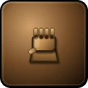
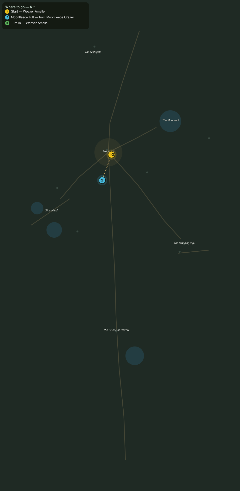

# Wool by Moonlight

> Quest ID: `q_nb_wool_by_moonlight` · The Nightbloom

| | |
|---|---|
| **Recommended level** | 20+ (zone range 20–20) |
| **Quest giver** | **Weaver Amelle**, Moonfleece Weaver _(at ~x:-366, z:1423)_ |
| **Turn in to** | **Weaver Amelle**, Moonfleece Weaver _(at ~x:-366, z:1423)_ |
| **Requires** | The Road of Lanterns (`q_nb_road_of_lanterns`) |

## Story

> Nothing warms like moonfleece, <your name>, and nothing spins so fine. The grazers carry their silver wool loose in tufts as they drift the downs. Bring me six good tufts off the herds and I will weave you something worth the walking.

## How to complete

- **Collect 6× Moonfleece Tuft**
  - Drops from [**Moonfleece Grazer**](bestiary.md#mob-moonfleece_grazer) (60% chance) — Found in the open world at ~x:-436, z:1466 (4 mobs, radius 12); Found in the open world at ~x:-320, z:1446 (3 mobs, radius 10)
  - _Tracker: Moonfleece Tuft_

Then return to **Weaver Amelle**, Moonfleece Weaver _(at ~x:-366, z:1423)_ to turn in.

## Rewards

- **XP:** 4600
- **Money:** 2200 copper
- **Item reward (by class):**
  -  🟢 Moonfleece Mitts — _warrior, mage, rogue_ · 54 armor, +3 Sta, +3 Spi

## On completion

> Silver as starlight and twice as soft. Here, $N: mitts from the last batch, lined the way only moonfleece lines.

## Where to go

**[🧭 Open this route in 3D →](#/questroute/q_nb_wool_by_moonlight)**

_Numbered route: ① start → objectives → 3 turn in. Faint dots are the rest of the zone for context — see the [full zone map](README.md). Mob names above link to the [bestiary](bestiary.md)._
