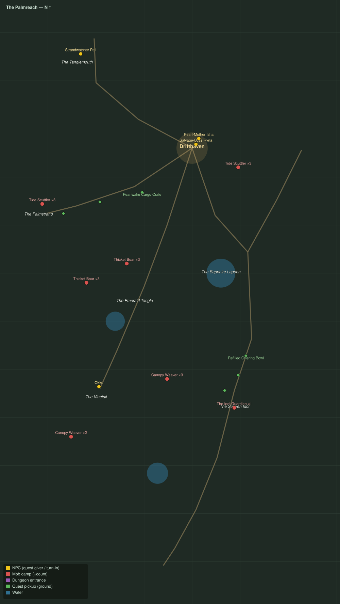

# The Palmreach

Level range: **20–20** · Hub: Drifthaven · 9 quests

_Gold = NPCs · red = mob camps (×count) · purple = dungeon entrances · green = ground pickups · blue = water._

📖 **[Bestiary for this zone](bestiary.md)** — every mob's health, armor, damage, and how to kill it.

| Lvl | Quest | Giver | Type |
|----:|-------|-------|------|
| 19 | [Down to Drifthaven](q-pr-down-to-drifthaven.md) | Strandwatcher Pell | interact |
| 20 | [The Wreck Line](q-pr-wreck-line-cargo.md) | Salvage-Boss Ryna | interact |
| 20 | [Shellbacked Thieves](q-pr-scuttler-cull.md) | Salvage-Boss Ryna | kill |
| 20 | [The Lost Navigator](q-pr-the-lost-navigator.md) | Salvage-Boss Ryna | escort |
| 20 | [Boars in the Gardens](q-pr-boars-in-the-gardens.md) | Pearl-Mother Isha | kill |
| 20 | [The Man Who Went In](q-pr-the-man-who-went-in.md) | Pearl-Mother Isha | interact |
| 20 | [Silk from the Canopy](q-pr-canopy-silk.md) | Okku | collect |
| 20 | [What the Drums Guard](q-pr-what-the-drums-guard.md) | Okku | kill/interact |
| 20 | [The Idol Guardian](q-pr-idol-guardian.md) 👥 | Okku | kill |
