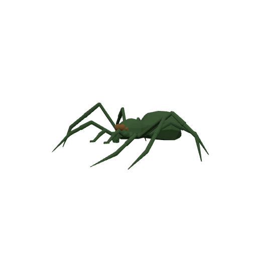
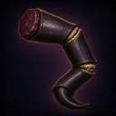
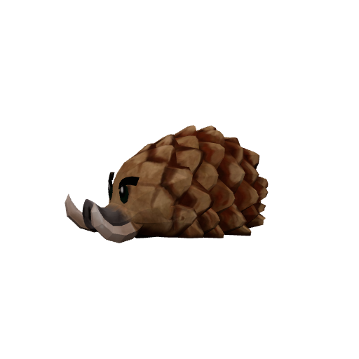
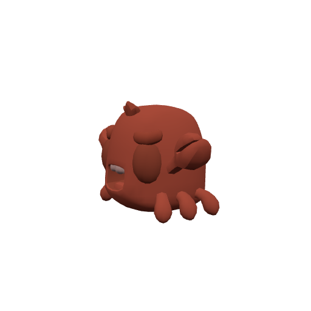
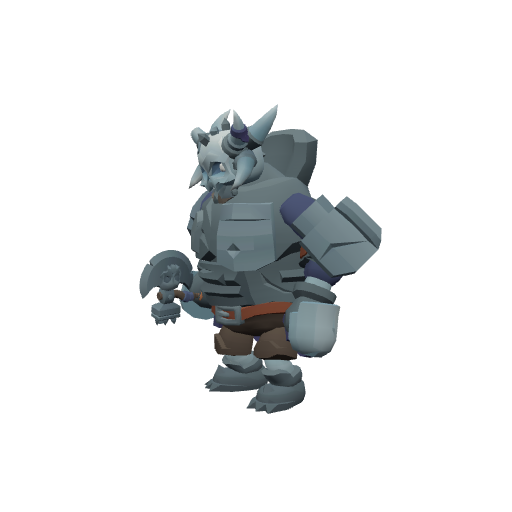

# Bestiary — The Palmreach

4 creatures you'll fight in this zone. Health/armor/damage are shown across the mob's spawn level range (mobs roll a random level within it). Mitigation % is what a same-level attacker's physical hits lose to armor — spells ignore armor.

> Threat tiers: **Boss** (dungeon, group it) · **Elite** (~2.3× HP, ~1.5× damage) · **Rare** (tough roamer) · normal (everything else).

## Common creatures

### Canopy Weaver

| Stat | Value |
|---|---|
| Level | 20 |
| Family | Spider |
| Health | 417 HP |
| Armor (physical mitigation) | 209 (~9% vs a same-level attacker) |
| Melee damage | 45–70 per hit @ 1.9s swing (~30 DPS) |
| Location | The Palmreach · ~x:-326, z:1060 · ~x:-426, z:1120 — [🗺️ show on map](#/map/-326/1060) |

**Best way to kill:**

- Straightforward melee attacker — tank it, heal as needed, and burn it down. No special tricks.

**Loot:**

- Coins: 105 copper (always drops)

| Item | Type | Drop chance | Notes |
|---|---|---:|---|
|   Canopy Silk Hank | Quest item | 60% | quest item — only drops while on _Silk from the Canopy_ |
|  ⚪ Twitching Spider Leg | Junk | 40% | sells for 4c |

### Thicket Boar

| Stat | Value |
|---|---|
| Level | 20 |
| Family | Beast |
| Health | 442 HP |
| Armor (physical mitigation) | 228 (~10% vs a same-level attacker) |
| Melee damage | 46–72 per hit @ 1.9s swing (~31 DPS) |
| Location | The Palmreach · ~x:-368, z:940 · ~x:-410, z:960 — [🗺️ show on map](#/map/-368/940) |

**Best way to kill:**

- Straightforward melee attacker — tank it, heal as needed, and burn it down. No special tricks.

**Loot:**

- Coins: 105 copper (always drops)

### Tide Scuttler

| Stat | Value |
|---|---|
| Level | 20 |
| Family | Beast |
| Health | 396 HP |
| Armor (physical mitigation) | 266 (~11% vs a same-level attacker) |
| Melee damage | 41–65 per hit @ 2s swing (~27 DPS) |
| Location | The Palmreach · ~x:-456, z:878 · ~x:-252, z:840 — [🗺️ show on map](#/map/-456/878) |

**Best way to kill:**

- Straightforward melee attacker — tank it, heal as needed, and burn it down. No special tricks.

**Loot:**

- Coins: 105 copper (always drops)

## Elites

### The Idol Guardian — _Elite_

| Stat | Value |
|---|---|
| Level | 20 |
| Family | Elemental |
| Health | 1831 HP |
| Armor (physical mitigation) | 342 (~14% vs a same-level attacker) |
| Melee damage | 89–139 per hit @ 2.4s swing (~48 DPS) |
| Respawn | ~25s |
| Location | The Palmreach · ~x:-256, z:1090 — [🗺️ show on map](#/map/-256/1090) |

**Best way to kill:**

- **Elite** — ~2.3× the health and ~1.5× the damage of a normal mob; bring a group or out-level it.
- Straightforward melee attacker — tank it, heal as needed, and burn it down. No special tricks.

**Loot:**

- Coins: 450 copper (always drops)

---

[← Back to The Palmreach quests](README.md) · [Zone map](map.svg)
