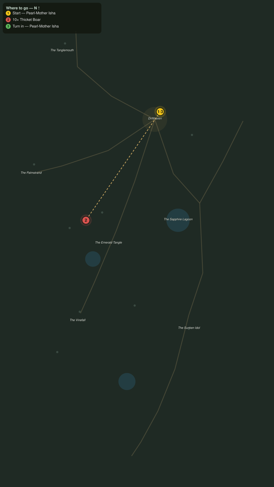

# Boars in the Gardens

> Quest ID: `q_pr_boars_in_the_gardens` · The Palmreach

| | |
|---|---|
| **Recommended level** | 20+ (zone range 20–20) |
| **Quest giver** | **Pearl-Mother Isha**, Elder of the Divers _(at ~x:-293, z:810)_ |
| **Turn in to** | **Pearl-Mother Isha**, Elder of the Divers _(at ~x:-293, z:810)_ |
| **Requires** | Down to Drifthaven (`q_pr_down_to_drifthaven`) |

## Story

> Whatever stirs in the deep green, it pushes the thicket boars out onto our strand. They have rooted up the garden terraces twice this week, and they will have the drying racks next. Ten boars, <your name>, and push the rest back under the trees.

## How to complete

- **Kill 10× [Thicket Boar](bestiary.md#mob-thicket_boar)** (level 20–20)
  - Found in the open world at ~x:-368, z:940 (3 mobs, radius 10)
  - Found in the open world at ~x:-410, z:960 (3 mobs, radius 10)
  - _Tracker: Thicket Boar driven off_

Then return to **Pearl-Mother Isha**, Elder of the Divers _(at ~x:-293, z:810)_ to turn in.

## Rewards

- **XP:** 4600
- **Money:** 2400 copper

## On completion

> The racks stand and the gardens can be replanted. The boars did not choose to come onto the sand, $N. Remember that: something moved them.

## Where to go

**[🧭 Open this route in 3D →](#/questroute/q_pr_boars_in_the_gardens)**

_Numbered route: ① start → objectives → 3 turn in. Faint dots are the rest of the zone for context — see the [full zone map](README.md). Mob names above link to the [bestiary](bestiary.md)._
