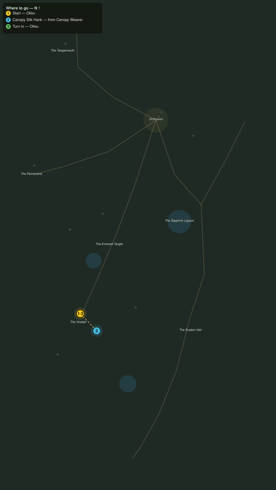

# Silk from the Canopy

> Quest ID: `q_pr_canopy_silk` · The Palmreach

| | |
|---|---|
| **Recommended level** | 20+ (zone range 20–20) |
| **Quest giver** | **Okku**, The Man Who Went In _(at ~x:-397, z:1068)_ |
| **Turn in to** | **Okku**, The Man Who Went In _(at ~x:-397, z:1068)_ |
| **Requires** | The Man Who Went In (`q_pr_the_man_who_went_in`) |

## Story

> Look up, <your name>. Every canopy from here to the idol is webbed like a fishing net, and the weavers grow bolder each season. I string their own silk across the paths, tripline bells, so the jungle cannot creep up on me. Six good hanks off the canopy weavers will restring my lines.

## How to complete

- **Collect 6× Canopy Silk Hank**
  - Drops from [**Canopy Weaver**](bestiary.md#mob-canopy_weaver) (60% chance) — Found in the open world at ~x:-326, z:1060 (3 mobs, radius 10); Found in the open world at ~x:-426, z:1120 (2 mobs, radius 10)
  - _Tracker: Canopy Silk Hank_

Then return to **Okku**, The Man Who Went In _(at ~x:-397, z:1068)_ to turn in.

## Rewards

- **XP:** 5000
- **Money:** 2600 copper

## On completion

> Good, strong silk. My bells will sing a while longer, and nothing walks these paths at night without me knowing, $N. Lately, something has been walking often.

## Leads to

- What the Drums Guard (`q_pr_what_the_drums_guard`)

## Where to go

**[🧭 Open this route in 3D →](#/questroute/q_pr_canopy_silk)**

_Numbered route: ① start → objectives → 3 turn in. Faint dots are the rest of the zone for context — see the [full zone map](README.md). Mob names above link to the [bestiary](bestiary.md)._
