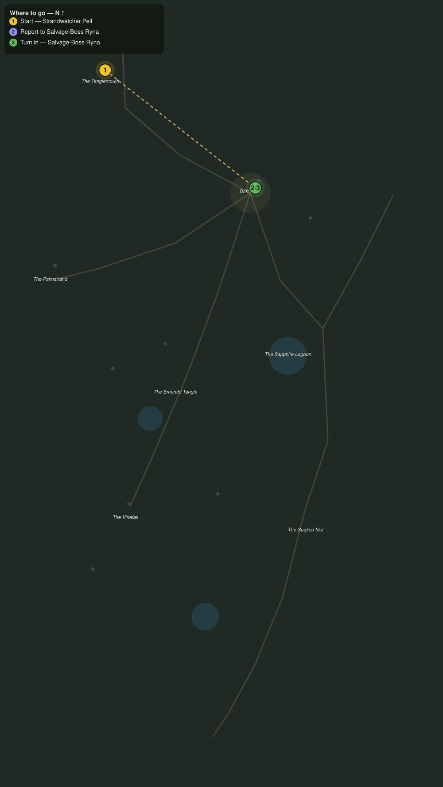

# Down to Drifthaven

> Quest ID: `q_pr_down_to_drifthaven` · The Palmreach

| | |
|---|---|
| **Recommended level** | 19+ |
| **Quest giver** | **Strandwatcher Pell**, Watcher of the Tanglemouth _(at ~x:-416, z:722)_ |
| **Turn in to** | **Salvage-Boss Ryna**, Mistress of the Wreck Line _(at ~x:-296, z:816)_ |

## Story

> Out of the black trees and into the sun, <your name>. Follow the shore road north and you will strike Drifthaven before the tide turns. Ask for Salvage-Boss Ryna, she has work for any pair of hands since the storm, and tell her the Tanglemouth road is still open.

## How to complete

- **Interact with **Salvage-Boss Ryna**, Mistress of the Wreck Line _(at ~x:-296, z:816)_**
  - _Tracker: Report to Salvage-Boss Ryna_

Then return to **Salvage-Boss Ryna**, Mistress of the Wreck Line _(at ~x:-296, z:816)_ to turn in.

## Rewards

- **XP:** 2600
- **Money:** 1000 copper

## On completion

> Pell sent you? Then you walked the whole Tanglemouth road alone, and that is reference enough for me. Welcome to Drifthaven, $N. Grab a rope, we are short-handed.

## Leads to

- The Wreck Line (`q_pr_wreck_line_cargo`)
- Shellbacked Thieves (`q_pr_scuttler_cull`)
- Boars in the Gardens (`q_pr_boars_in_the_gardens`)
- The Man Who Went In (`q_pr_the_man_who_went_in`)

## Where to go

**[🧭 Open this route in 3D →](#/questroute/q_pr_down_to_drifthaven)**

_Numbered route: ① start → objectives → 3 turn in. Faint dots are the rest of the zone for context — see the [full zone map](README.md). Mob names above link to the [bestiary](bestiary.md)._
