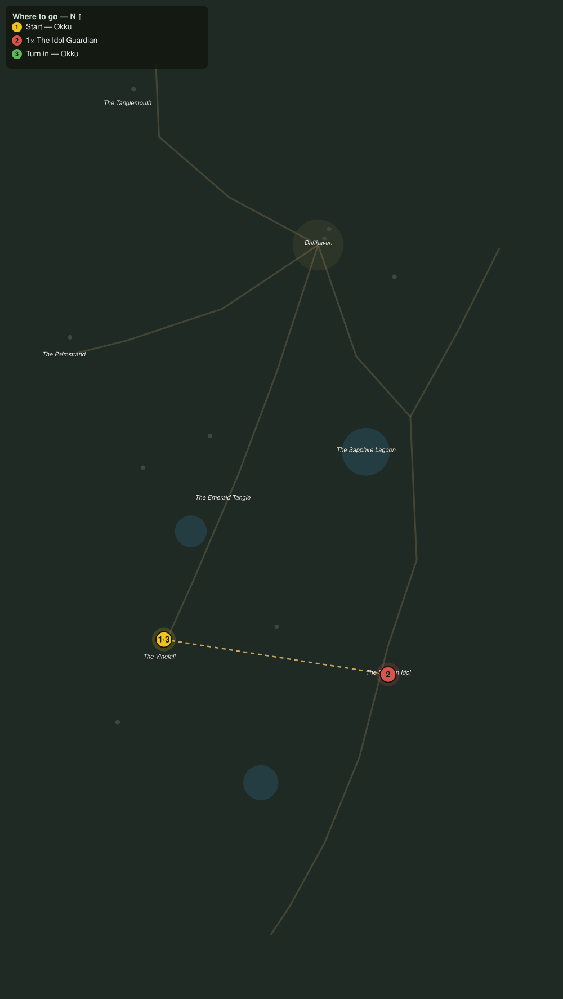

# The Idol Guardian

> Quest ID: `q_pr_idol_guardian` · The Palmreach

| | |
|---|---|
| **Recommended level** | 20+ |
| **Quest giver** | **Okku**, The Man Who Went In _(at ~x:-397, z:1068)_ |
| **Turn in to** | **Okku**, The Man Who Went In _(at ~x:-397, z:1068)_ |
| **Requires** | What the Drums Guard (`q_pr_what_the_drums_guard`) |
| **Group quest** | 👥 Suggested players: 2 |

## Story

> The idol is older than the island, <your name>. Older than the drums, older than the name Palmreach. Its Guardian has stood in that drowned ring since before the palms grew, and now it wakes and walks the columns at night. Whatever the offerings feed, the Guardian is its door-ward. Bring a friend, and break it.

## How to complete

- **Kill 1× [The Idol Guardian](bestiary.md#mob-idol_guardian)** (level 20–20, **Elite**)
  - Found in the open world at ~x:-256, z:1090 (1 mob, radius 5)
  - _Tracker: The Idol Guardian broken_

Then return to **Okku**, The Man Who Went In _(at ~x:-397, z:1068)_ to turn in.

## Rewards

- **XP:** 6200
- **Money:** 3800 copper
- **Item reward (by class):**
  -  🔵 Mantle of the Sunken Idol — _warrior, mage, rogue_ · 76 armor, +6 Sta, +4 Spi

## On completion

> You felled a thing the jungle itself would not touch. Look there, behind the idol: the Guardian was never guarding the columns, $N, it was guarding the steps beneath them. The drums have gone quiet tonight. Whatever sleeps below the Wildheart Basin now knows your name.

## Where to go

**[🧭 Open this route in 3D →](#/questroute/q_pr_idol_guardian)**

_Numbered route: ① start → objectives → 3 turn in. Faint dots are the rest of the zone for context — see the [full zone map](README.md). Mob names above link to the [bestiary](bestiary.md)._
