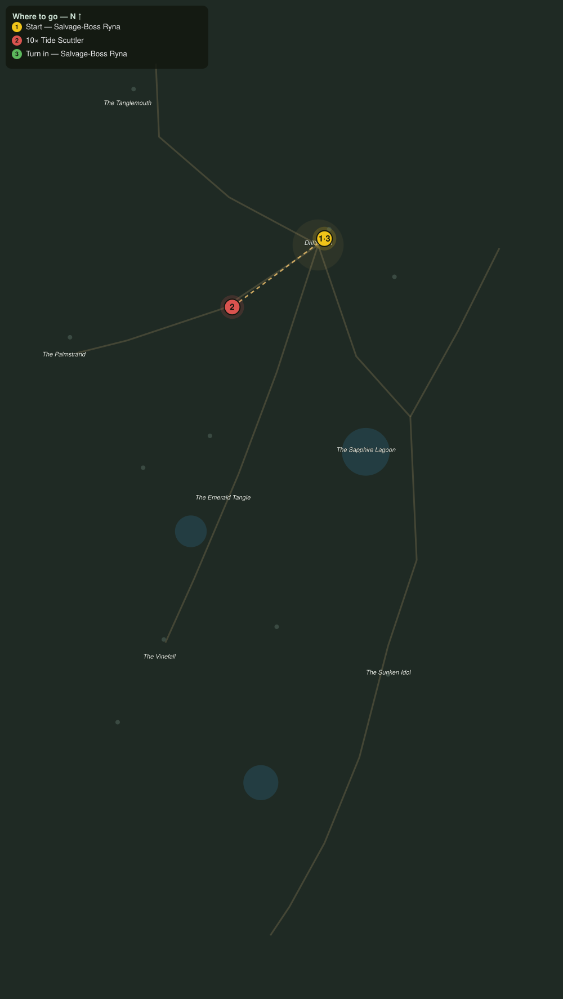

# Shellbacked Thieves

> Quest ID: `q_pr_scuttler_cull` · The Palmreach

| | |
|---|---|
| **Recommended level** | 20+ (zone range 20–20) |
| **Quest giver** | **Salvage-Boss Ryna**, Mistress of the Wreck Line _(at ~x:-296, z:816)_ |
| **Turn in to** | **Salvage-Boss Ryna**, Mistress of the Wreck Line _(at ~x:-296, z:816)_ |
| **Requires** | Down to Drifthaven (`q_pr_down_to_drifthaven`) |

## Story

> Every wreck on this coast draws the tide scuttlers, and the Pearlwake has drawn half the reef. My salvage crews will not work a line with those claws in the shallows. Crack ten of them, <your name>, and the wreck line is ours again.

## How to complete

- **Kill 10× [Tide Scuttler](bestiary.md#mob-tide_scuttler)** (level 20–20)
  - Found in the open world at ~x:-456, z:878 (3 mobs, radius 10)
  - Found in the open world at ~x:-252, z:840 (3 mobs, radius 10)
  - _Tracker: Tide Scuttler cracked_

Then return to **Salvage-Boss Ryna**, Mistress of the Wreck Line _(at ~x:-296, z:816)_ to turn in.

## Rewards

- **XP:** 4800
- **Money:** 2400 copper

## On completion

> Ten fewer claws in the surf. My crews are already wading back out, and not one of them said thank you, so I will: thank you, $N.

## Where to go

**[🧭 Open this route in 3D →](#/questroute/q_pr_scuttler_cull)**

_Numbered route: ① start → objectives → 3 turn in. Faint dots are the rest of the zone for context — see the [full zone map](README.md). Mob names above link to the [bestiary](bestiary.md)._
