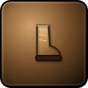
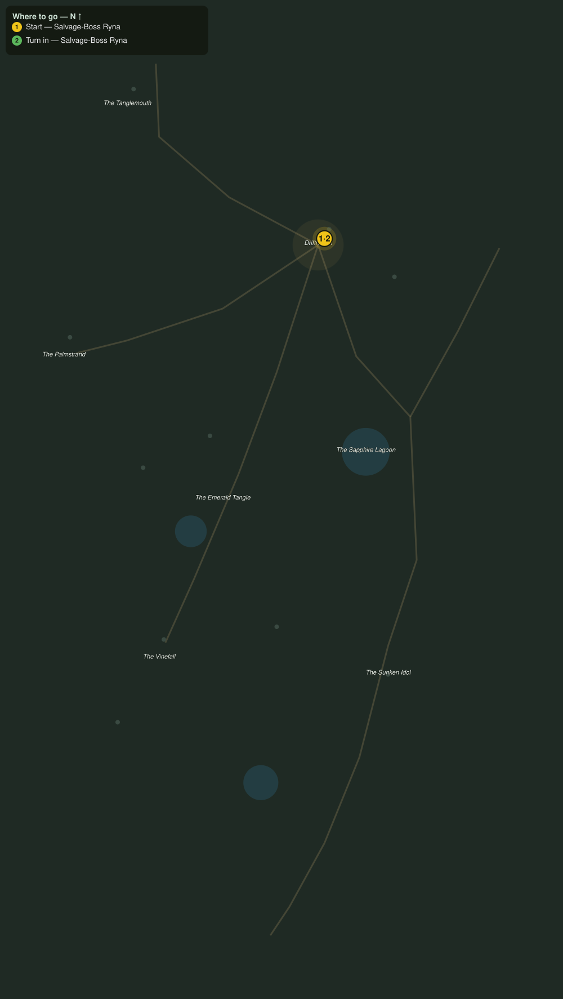

# The Lost Navigator

> Quest ID: `q_pr_the_lost_navigator` · The Palmreach

| | |
|---|---|
| **Recommended level** | 20+ |
| **Quest giver** | **Salvage-Boss Ryna**, Mistress of the Wreck Line _(at ~x:-296, z:816)_ |
| **Turn in to** | **Salvage-Boss Ryna**, Mistress of the Wreck Line _(at ~x:-296, z:816)_ |
| **Requires** | The Wreck Line (`q_pr_wreck_line_cargo`) |

## Story

> We pulled every hand off the Pearlwake but one: Navigator Suli, who swam for the far strand and never walked in. A diver spotted her holed up in the bow wreckage past the Palmstrand, alive, and too spent to run the gauntlet alone. Walk her home along the shore road, <your name>. The crabs will not like it, and the jungle likes it less.

## How to complete

  - _Tracker: Navigator Suli seen safely to Drifthaven_

Then return to **Salvage-Boss Ryna**, Mistress of the Wreck Line _(at ~x:-296, z:816)_ to turn in.

## Rewards

- **XP:** 5600
- **Money:** 3200 copper
- **Item reward (by class):**
  -  🟢 Saltwalker Sandals — _warrior, mage, rogue_ · 60 armor, +3 Agi, +2 Sta

## On completion

> Suli is by the fire, still swearing she could have swum it. You brought back the only chart-reader on this coast, $N. These are from her sea chest, with her blessing.

## Where to go

**[🧭 Open this route in 3D →](#/questroute/q_pr_the_lost_navigator)**

_Numbered route: ① start → objectives → 3 turn in. Faint dots are the rest of the zone for context — see the [full zone map](README.md). Mob names above link to the [bestiary](bestiary.md)._
