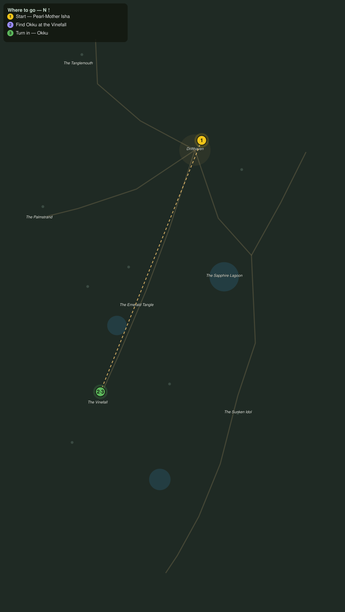

# The Man Who Went In

> Quest ID: `q_pr_the_man_who_went_in` · The Palmreach

| | |
|---|---|
| **Recommended level** | 20+ |
| **Quest giver** | **Pearl-Mother Isha**, Elder of the Divers _(at ~x:-293, z:810)_ |
| **Turn in to** | **Okku**, The Man Who Went In _(at ~x:-397, z:1068)_ |
| **Requires** | Down to Drifthaven (`q_pr_down_to_drifthaven`) |

## Story

> The divers will not step past the treeline, <your name>, and I will not ask them to. You have heard the drums by now: everyone does, by the second night. One man on this island ever walked toward that sound and came back. Okku. He camps under the great banyans at the Vinefall, deep up the Tangle road. Find him, and ask him what the green is hiding.

## How to complete

- **Interact with **Okku**, The Man Who Went In _(at ~x:-397, z:1068)_**
  - _Tracker: Find Okku at the Vinefall_

Then return to **Okku**, The Man Who Went In _(at ~x:-397, z:1068)_ to turn in.

## Rewards

- **XP:** 2800
- **Money:** 1100 copper

## On completion

> Isha sent you? The Pearl-Mother has not spoken my name in years. Sit out of the vines' reach, $N, and I will tell you what I know: the drums are not the danger. They are the warning.

## Leads to

- Silk from the Canopy (`q_pr_canopy_silk`)

## Where to go

**[🧭 Open this route in 3D →](#/questroute/q_pr_the_man_who_went_in)**

_Numbered route: ① start → objectives → 3 turn in. Faint dots are the rest of the zone for context — see the [full zone map](README.md). Mob names above link to the [bestiary](bestiary.md)._
