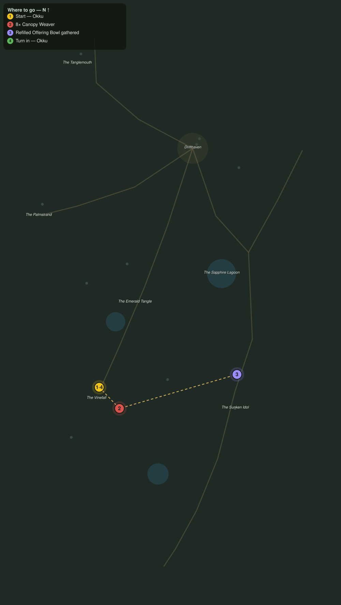

# What the Drums Guard

> Quest ID: `q_pr_what_the_drums_guard` · The Palmreach

| | |
|---|---|
| **Recommended level** | 20+ |
| **Quest giver** | **Okku**, The Man Who Went In _(at ~x:-397, z:1068)_ |
| **Turn in to** | **Okku**, The Man Who Went In _(at ~x:-397, z:1068)_ |
| **Requires** | Silk from the Canopy (`q_pr_canopy_silk`) |

## Story

> I have walked as near the Sunken Idol as a living man dares, and I saw two things: the weavers have curtained the idol road in web, and the old offering bowls along it have been filled again. Freshly, <your name>. Cut eight weavers off the road and bring me three of those offerings. I would know what hand still feeds a dead god.

## How to complete

- **Kill 8× [Canopy Weaver](bestiary.md#mob-canopy_weaver)** (level 20–20)
  - Found in the open world at ~x:-326, z:1060 (3 mobs, radius 10)
  - Found in the open world at ~x:-426, z:1120 (2 mobs, radius 10)
  - _Tracker: Canopy Weaver cut down_
- **Interact 3× with Refilled Offering Bowl**
  - Locations: ~x:-244, z:1036 · ~x:-252, z:1056 · ~x:-266, z:1072
  - _Tracker: Refilled Offering Bowl gathered_

Then return to **Okku**, The Man Who Went In _(at ~x:-397, z:1068)_ to turn in.

## Rewards

- **XP:** 5200
- **Money:** 2800 copper

## On completion

> Moss, pearl-shell, and boar blood, packed by fingers. Something in that ruin still keeps its rites, $N, and the Guardian keeps everything else out. It is time we spoke of it plainly.

## Leads to

- The Idol Guardian (`q_pr_idol_guardian`)

## Where to go

**[🧭 Open this route in 3D →](#/questroute/q_pr_what_the_drums_guard)**

_Numbered route: ① start → objectives → 4 turn in. Faint dots are the rest of the zone for context — see the [full zone map](README.md). Mob names above link to the [bestiary](bestiary.md)._
