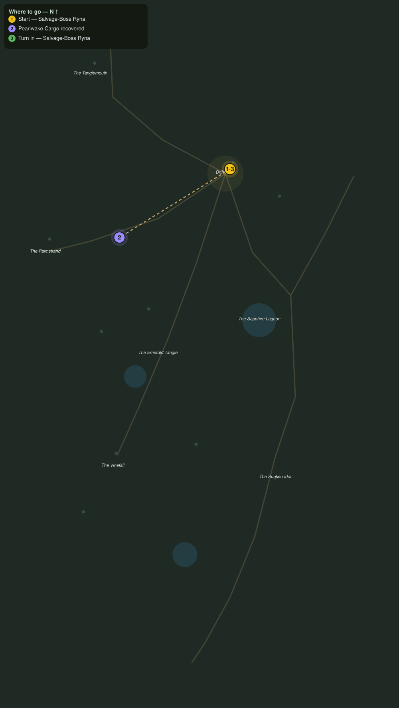

# The Wreck Line

> Quest ID: `q_pr_wreck_line_cargo` · The Palmreach

| | |
|---|---|
| **Recommended level** | 20+ (zone range 20–20) |
| **Quest giver** | **Salvage-Boss Ryna**, Mistress of the Wreck Line _(at ~x:-296, z:816)_ |
| **Turn in to** | **Salvage-Boss Ryna**, Mistress of the Wreck Line _(at ~x:-296, z:816)_ |
| **Requires** | Down to Drifthaven (`q_pr_down_to_drifthaven`) |

## Story

> The storm three nights back drove the Pearlwake onto the reef, and her cargo is strewn the whole length of the wreck line between here and the Palmstrand. Three crates of trade goods are still lying in the surf, <your name>. Bring them in before the tide, or the crabs, claim what is left.

## How to complete

- **Interact 3× with Pearlwake Cargo Crate**
  - Locations: ~x:-352, z:866 · ~x:-396, z:876 · ~x:-434, z:888
  - _Tracker: Pearlwake Cargo recovered_

Then return to **Salvage-Boss Ryna**, Mistress of the Wreck Line _(at ~x:-296, z:816)_ to turn in.

## Rewards

- **XP:** 4600
- **Money:** 2400 copper

## On completion

> Salt-stained but sound, all three. The divers eat this month because of you, $N.

## Leads to

- The Lost Navigator (`q_pr_the_lost_navigator`)

## Where to go

**[🧭 Open this route in 3D →](#/questroute/q_pr_wreck_line_cargo)**

_Numbered route: ① start → objectives → 3 turn in. Faint dots are the rest of the zone for context — see the [full zone map](README.md). Mob names above link to the [bestiary](bestiary.md)._
