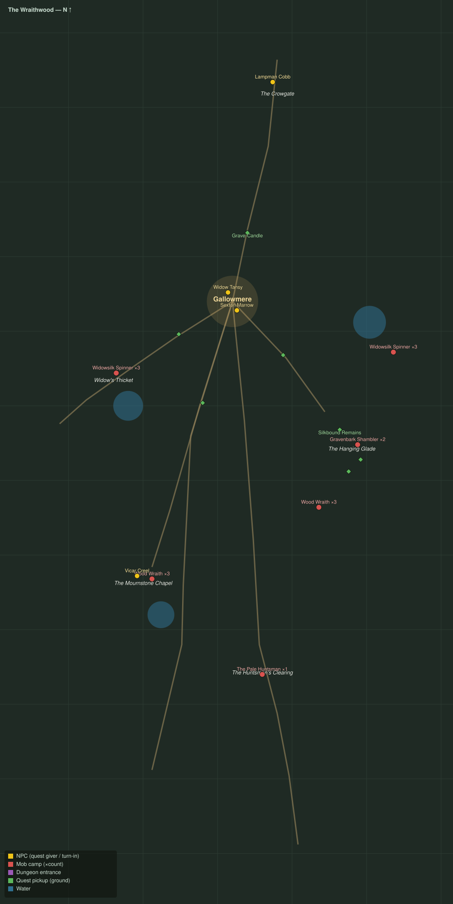

# The Wraithwood

Level range: **20–20** · Hub: Gallowmere · 9 quests

_Gold = NPCs · red = mob camps (×count) · purple = dungeon entrances · green = ground pickups · blue = water._

📖 **[Bestiary for this zone](bestiary.md)** — every mob's health, armor, damage, and how to kill it.

| Lvl | Quest | Giver | Type |
|----:|-------|-------|------|
| 19 | [The Bells of Gallowmere](q-ww-bells-of-gallowmere.md) | Lampman Cobb | interact |
| 20 | [Silk in the Eaves](q-ww-silk-in-the-eaves.md) | Sexton Marrow | kill |
| 20 | [The Widow's Skeins](q-ww-widows-skeins.md) | Widow Tansy | collect |
| 20 | [Candles at the Bounds](q-ww-candles-at-the-bounds.md) | Widow Tansy | interact |
| 20 | [The Last Vicar](q-ww-the-last-vicar.md) | Sexton Marrow | interact |
| 20 | [Wraiths of the Tarn](q-ww-wraiths-of-the-tarn.md) | Vicar Creel | kill |
| 20 | [What the Bark Holds](q-ww-what-the-bark-holds.md) | Vicar Creel | kill/interact |
| 20 | [Walking Mosley Home](q-ww-walking-mosley-home.md) | Sexton Marrow | escort |
| 20 | [The Horn of the Huntsman](q-ww-horn-of-the-huntsman.md) 👥 | Vicar Creel | kill |
