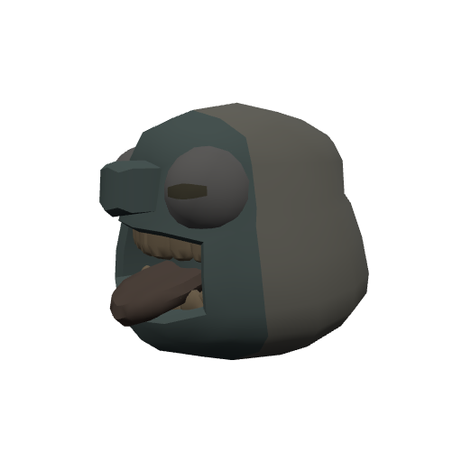
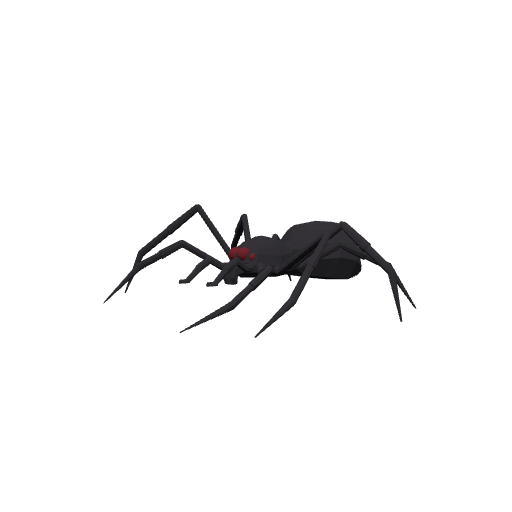
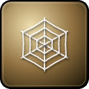
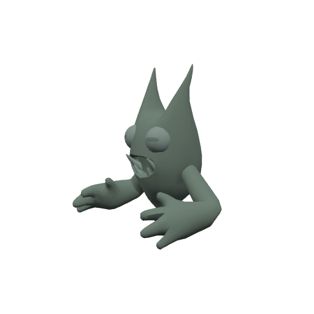
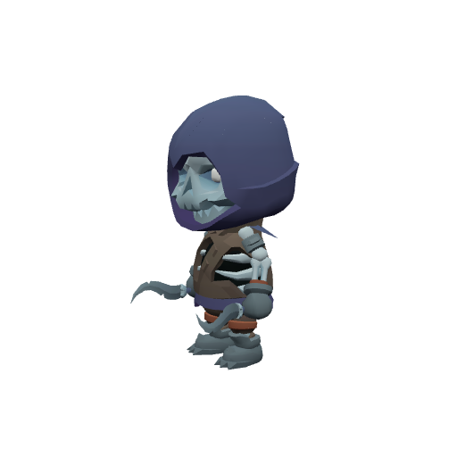

# Bestiary — The Wraithwood

4 creatures you'll fight in this zone. Health/armor/damage are shown across the mob's spawn level range (mobs roll a random level within it). Mitigation % is what a same-level attacker's physical hits lose to armor — spells ignore armor.

> Threat tiers: **Boss** (dungeon, group it) · **Elite** (~2.3× HP, ~1.5× damage) · **Rare** (tough roamer) · normal (everything else).

## Common creatures

### Gravenbark Shambler

| Stat | Value |
|---|---|
| Level | 20 |
| Family | Ogre |
| Health | 584 HP |
| Armor (physical mitigation) | 285 (~12% vs a same-level attacker) |
| Melee damage | 51–79 per hit @ 2.6s swing (~25 DPS) |
| Location | The Wraithwood · ~x:444, z:1526 — [🗺️ show on map](#/map/444/1526) |

**Best way to kill:**

- Straightforward melee attacker — tank it, heal as needed, and burn it down. No special tricks.

**Loot:**

- Coins: 115 copper (always drops)

| Item | Type | Drop chance | Notes |
|---|---|---:|---|
|  ⚫ Tangled Weed | Junk | 40% | sells for 1c |

### Widowsilk Spinner

| Stat | Value |
|---|---|
| Level | 20 |
| Family | Spider |
| Health | 436 HP |
| Armor (physical mitigation) | 228 (~10% vs a same-level attacker) |
| Melee damage | 46–72 per hit @ 1.9s swing (~31 DPS) |
| Location | The Wraithwood · ~x:282, z:1478 · ~x:468, z:1464 — [🗺️ show on map](#/map/282/1478) |

**Best way to kill:**

- Straightforward melee attacker — tank it, heal as needed, and burn it down. No special tricks.

**Loot:**

- Coins: 105 copper (always drops)

| Item | Type | Drop chance | Notes |
|---|---|---:|---|
|   Widowsilk Skein | Quest item | 60% | quest item — only drops while on _The Widow's Skeins_ |
|  ⚪ Twitching Spider Leg | Junk | 40% | sells for 4c |

### Wood Wraith

| Stat | Value |
|---|---|
| Level | 20 |
| Family | Elemental |
| Health | 394 HP |
| Armor (physical mitigation) | 190 (~8% vs a same-level attacker) |
| Melee damage | 44–68 per hit @ 2s swing (~28 DPS) |
| Location | The Wraithwood · ~x:306, z:1616 · ~x:418, z:1568 — [🗺️ show on map](#/map/306/1616) |

**Best way to kill:**

- Straightforward melee attacker — tank it, heal as needed, and burn it down. No special tricks.

**Loot:**

- Coins: 110 copper (always drops)

## Elites

### The Pale Huntsman — _Elite_

| Stat | Value |
|---|---|
| Level | 20 |
| Family | Undead |
| Health | 1842 HP |
| Armor (physical mitigation) | 323 (~13% vs a same-level attacker) |
| Melee damage | 89–139 per hit @ 2.2s swing (~52 DPS) |
| Respawn | ~25s |
| Location | The Wraithwood · ~x:380, z:1680 — [🗺️ show on map](#/map/380/1680) |

**Best way to kill:**

- **Elite** — ~2.3× the health and ~1.5× the damage of a normal mob; bring a group or out-level it.
- Straightforward melee attacker — tank it, heal as needed, and burn it down. No special tricks.

**Loot:**

- Coins: 450 copper (always drops)

| Item | Type | Drop chance | Notes |
|---|---|---:|---|
|  ⚪ Bone Fragments | Junk | 100% | sells for 7c |

---

[← Back to The Wraithwood quests](README.md) · [Zone map](map.svg)
