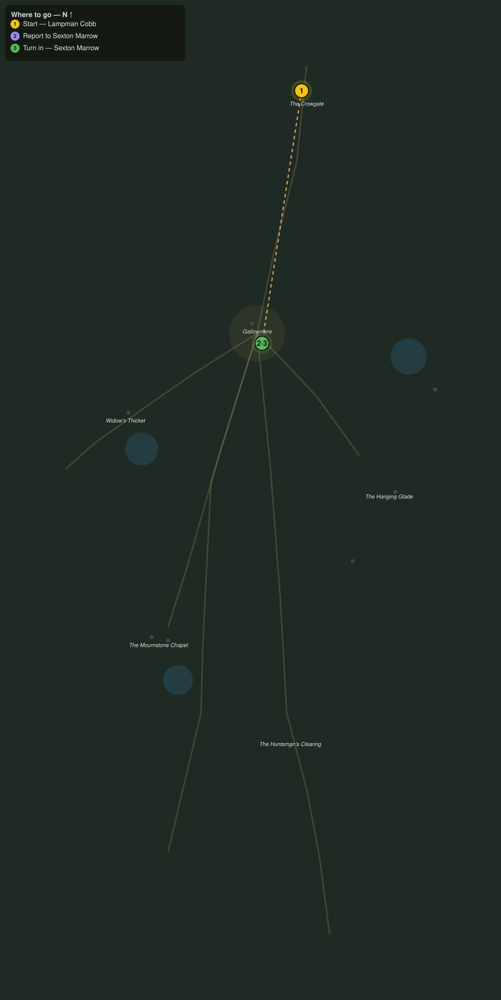

# The Bells of Gallowmere

> Quest ID: `q_ww_bells_of_gallowmere` · The Wraithwood

| | |
|---|---|
| **Recommended level** | 19+ |
| **Quest giver** | **Lampman Cobb**, Keeper of the Crowgate Lanterns _(at ~x:387, z:1283)_ |
| **Turn in to** | **Sexton Marrow**, Sexton of Gallowmere _(at ~x:363, z:1436)_ |

## Story

> Hear that tolling, <your name>? That is Gallowmere, up the north road, ringing its dead to sleep. Sexton Marrow keeps the count of every soul under the canopy, living and buried. Go and be counted, before the wood counts you itself.

## How to complete

- **Interact with **Sexton Marrow**, Sexton of Gallowmere _(at ~x:363, z:1436)_**
  - _Tracker: Report to Sexton Marrow_

Then return to **Sexton Marrow**, Sexton of Gallowmere _(at ~x:363, z:1436)_ to turn in.

## Rewards

- **XP:** 2600
- **Money:** 1000 copper

## On completion

> Cobb sent you up the road whole, did he? Good man. He has kept those gate lanterns lit for thirty years, and the wood has never once got past him. Welcome to Gallowmere, $N. Mind the bells.

## Leads to

- Silk in the Eaves (`q_ww_silk_in_the_eaves`)
- The Widow's Skeins (`q_ww_widows_skeins`)
- Candles at the Bounds (`q_ww_candles_at_the_bounds`)

## Where to go

**[🧭 Open this route in 3D →](#/questroute/q_ww_bells_of_gallowmere)**

_Numbered route: ① start → objectives → 3 turn in. Faint dots are the rest of the zone for context — see the [full zone map](README.md). Mob names above link to the [bestiary](bestiary.md)._
