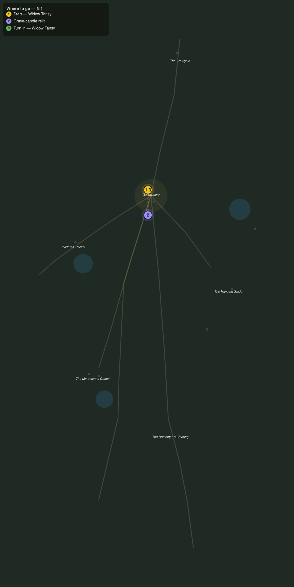

# Candles at the Bounds

> Quest ID: `q_ww_candles_at_the_bounds` · The Wraithwood

| | |
|---|---|
| **Recommended level** | 20+ (zone range 20–20) |
| **Quest giver** | **Widow Tansy**, Candlewright of Gallowmere _(at ~x:357, z:1424)_ |
| **Turn in to** | **Widow Tansy**, Candlewright of Gallowmere _(at ~x:357, z:1424)_ |
| **Requires** | The Bells of Gallowmere (`q_ww_bells_of_gallowmere`) |

## Story

> Four boundary stones ring Gallowmere, <your name>, one on each road out, and a grave-candle burns on every stone. While they burn, the buried stay buried. The drizzle has drowned them, all four, and I am too old to walk the bounds alone. Take my taper and relight them, quickly.

## How to complete

- **Interact 4× with Grave-Candle**
  - Locations: ~x:370, z:1384 · ~x:324, z:1452 · ~x:394, z:1466 · ~x:340, z:1498
  - _Tracker: Grave-candle relit_

Then return to **Widow Tansy**, Candlewright of Gallowmere _(at ~x:357, z:1424)_ to turn in.

## Rewards

- **XP:** 4600
- **Money:** 2200 copper

## On completion

> All four burning? Then breathe, $N. You did not hear it, but the whole village did: the bells rang easier the moment the last wick caught.

## Where to go

**[🧭 Open this route in 3D →](#/questroute/q_ww_candles_at_the_bounds)**

_Numbered route: ① start → objectives → 3 turn in. Faint dots are the rest of the zone for context — see the [full zone map](README.md). Mob names above link to the [bestiary](bestiary.md)._
