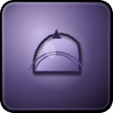
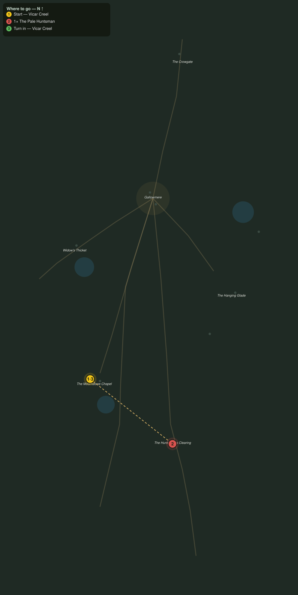

# The Horn of the Huntsman

> Quest ID: `q_ww_horn_of_the_huntsman` · The Wraithwood

| | |
|---|---|
| **Recommended level** | 20+ |
| **Quest giver** | **Vicar Creel**, Last Vicar of the Mournstone _(at ~x:296, z:1614)_ |
| **Turn in to** | **Vicar Creel**, Last Vicar of the Mournstone _(at ~x:296, z:1614)_ |
| **Requires** | What the Bark Holds (`q_ww_what_the_bark_holds`) |
| **Group quest** | 👥 Suggested players: 2 |

## Story

> You have heard the horn by now, <your name>, thin and far off, the sound the whole wood holds its breath for. The Pale Huntsman rides his clearing north of here, and every grave he passes grows shallower. He was a man once, and he was buried wrong, and I am done pretending prayer will do it. Take a friend, take two, and unhorse him.

## How to complete

- **Kill 1× [The Pale Huntsman](bestiary.md#mob-pale_huntsman)** (level 20–20, **Elite**)
  - Found in the open world at ~x:380, z:1680 (1 mob, radius 5)
  - _Tracker: The Pale Huntsman unhorsed_

Then return to **Vicar Creel**, Last Vicar of the Mournstone _(at ~x:296, z:1614)_ to turn in.

## Rewards

- **XP:** 6200
- **Money:** 3800 copper
- **Item reward (by class):**
  -  🔵 Mantle of the Unhorsed — _warrior, mage, rogue_ · 76 armor, +6 Sta, +4 Spi

## On completion

> The horn stopped mid-note. Every bell in Gallowmere rang once, on its own, and then the wood went quieter than I have heard it in thirty years. You have done the rite I could not, $N. Wear this, and walk under the canopy unafraid.

## Where to go

**[🧭 Open this route in 3D →](#/questroute/q_ww_horn_of_the_huntsman)**

_Numbered route: ① start → objectives → 3 turn in. Faint dots are the rest of the zone for context — see the [full zone map](README.md). Mob names above link to the [bestiary](bestiary.md)._
